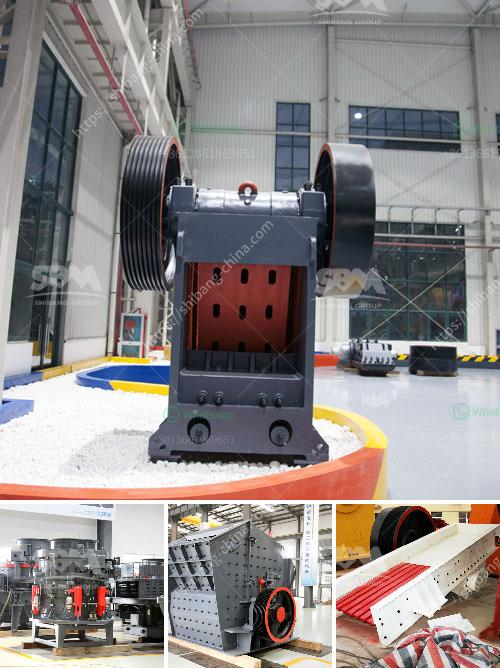

<h3>sell plant of crushing mobile</h3>
In today's fast-paced world, where technology is constantly evolving, mobile crushing plants have become increasingly popular. These plants offer numerous advantages, making them highly sought after in various industries such as mining, construction, and recycling. The demand for mobile crushing plants has skyrocketed, making it an opportune time for businesses to invest in this profitable venture.

Mobile crushing plants are versatile, efficient, and cost-effective. They are designed to crush rocks, minerals, and other materials directly at the mining site, eliminating the need to transport the materials to a stationary plant. This not only saves time but also reduces transportation costs, making it an economically viable option. Additionally, mobile crushing plants are compact and can be easily transported from one job site to another, further enhancing their convenience.

One of the key advantages of mobile crushing plants is their ability to adapt to various applications. Whether it's crushing hard rocks or processing recycled materials, these plants can efficiently handle a wide range of tasks. This versatility allows businesses to expand their operations and cater to diverse customer needs.

Furthermore, mobile crushing plants are equipped with advanced features that maximize productivity. They are engineered with powerful crushers, efficient screens, and reliable conveyors to ensure smooth and uninterrupted operations. Moreover, these plants can be equipped with additional features such as dust suppression systems and noise reduction technologies, making them environmentally friendly.

Investing in a mobile crushing plant can be highly profitable for businesses. As the demand for construction materials continues to rise, the need for crushing services increases. This presents an excellent opportunity for entrepreneurs to tap into the market and capitalize on this growing demand. By offering crushing services on-site, businesses can save on transportation costs and offer competitive pricing, attracting more customers.

Selling a mobile crushing plant requires strategic planning and effective marketing. Businesses should consider targeting potential customers, such as mining companies, construction firms, and recycling facilities. Creating awareness about the benefits of mobile crushing plants through targeted advertising and promotional campaigns can attract potential buyers.

Additionally, providing after-sales services and support to customers is crucial for building a strong reputation in the market. This includes offering maintenance services, spare parts availability, and technical assistance. By assuring customers of continuous support, businesses can build long-term relationships and establish themselves as trusted suppliers.

In conclusion, the demand for mobile crushing plants is on the rise, presenting a lucrative opportunity for businesses. These plants offer numerous advantages such as cost-effectiveness, versatility, and productivity. By investing in a mobile crushing plant and effectively marketing its benefits, businesses can tap into the growing demand for crushing services and generate substantial profits. However, it is important to provide excellent after-sales support to build trust and loyalty amongst customers. With careful planning and execution, selling mobile crushing plants can be a highly profitable venture.
<h3>Contact us</h3><ul><li><strong>Whatsapp:&nbsp;<a href="https://wa.me/8613661969651">+8613661969651</a></strong></li><li><a href="https://swt.shibang-china.com/?git&amp;zhl&amp;sell plant of crushing mobile"><strong>Online Service(chat now)</strong></a></li></ul><h3>Related</h3><ul><li><a href='mill gypsum for sale in india.md'>mill gypsum for sale in india</a></li><li><a href='old stone crusher for sale.md'>old stone crusher for sale</a></li><li><a href='used in cement plant.md'>used in cement plant</a></li><li><a href='10 allis chalmers jaw crusher.md'>10 allis chalmers jaw crusher</a></li><li><a href='stone crusher equipment for sale.md'>stone crusher equipment for sale</a></li></ul>