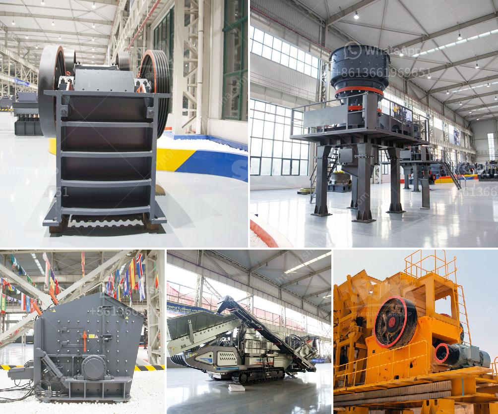

<h3>semi industrial stone crusher</h3>
A stone crusher is a machine designed to reduce large rocks into smaller rocks, gravel, or rock dust. Stone crushers may be used to reduce the size, or change the form, of waste materials so they can be more easily disposed of or recycled, or to reduce the size of a solid mix of raw materials (as in rock ore), so that pieces of different composition can be differentiated.

The semi-industrial stone crusher usually consists of a crusher, bucket elevator, storage bin, vibrating feeder, micro-grinding host, frequency classifier, double cyclone dust collector, pulse dust removal system, high-pressure fan, air compression Machine, electrical control system and other components. When used, it is equipped with a power cabinet and a dust-proof electric control box which is easy to operate, convenient, and intelligent.

The main advantages of the semi-industrial stone crusher are a significant increase in output, a significant reduction in energy consumption, and a high degree of automation. The crushers can handle stone with a side length of 100-500mm and have the advantages of large crushing ratio and cubic particles after crushing, which is suitable for crushing hard materials and producing high-quality aggregates. In addition, the semi-industrial stone crusher has a hydraulic system for protection and adjustment, which makes it convenient and efficient for users to operate and maintain.

The semi-industrial stone crusher is typically powered by a 380V three-phase power supply, and the power consumption is generally between 30-200 kW. The equipment's efficiency and output also depend on the type of stone you are dealing with.

Another notable feature of the semi-industrial stone crusher is that it is highly adaptable. It can crush a variety of materials, ranging from limestone to basalt, and can also handle materials with different hardness levels. This means that the crusher can be used in various construction projects, such as road construction, building construction, and bridge construction, to meet the needs of different customers.

When it comes to purchasing a semi-industrial stone crusher, several factors should be considered. The first factor is the production capacity required. Typically, a stone crusher with a larger capacity will have a higher price. The second factor is the quality and type of material the crusher will handle. Some crushers are more suitable for crushing hard materials while others may be better for softer materials. Additionally, the brand and reputation of the manufacturer should also be considered, as it reflects the reliability and after-sales support provided.

In conclusion, the semi-industrial stone crusher is a heavy-duty machine that can crush stone and rock materials into smaller sizes. With higher production capacity and greater durability, it is an ideal choice for customers in industries such as mining, road construction, and building construction. However, it is important to choose the right crusher based on the specific requirements and conditions of the project.
<h3>Contact us</h3><ul><li><strong>Whatsapp:&nbsp;<a href="https://wa.me/8613661969651">+8613661969651</a></strong></li><li><a href="https://swt.shibang-china.com/?git&amp;zhl&amp;semi industrial stone crusher"><strong>Online Service(chat now)</strong></a></li></ul><h3>Related</h3><ul><li><a href='slag crusher machine india.md'>slag crusher machine india</a></li><li><a href='fly ash processing plant for sale.md'>fly ash processing plant for sale</a></li><li><a href='cost of mobile crusher in india.md'>cost of mobile crusher in india</a></li><li><a href='tracked jaw crusher for sale.md'>tracked jaw crusher for sale</a></li><li><a href='supplier of gold desorption plant in china.md'>supplier of gold desorption plant in china</a></li></ul>