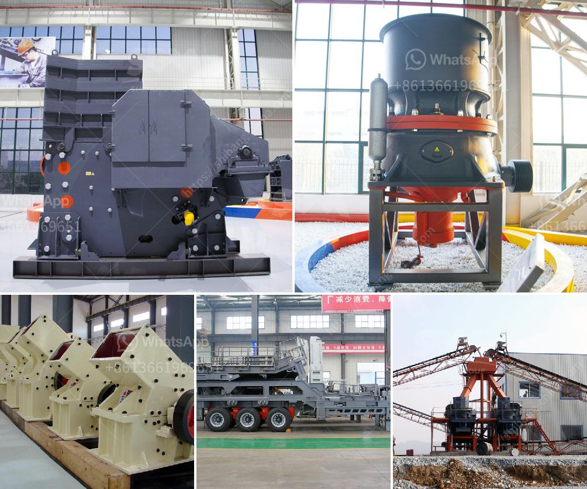

<h3>services nigeria conveyor machine</h3>
Nigeria is one of the most populous countries in Africa and has a thriving industrial sector. As the demand for manufactured goods continues to grow, there is an increasing need for efficient conveyor systems to enable the smooth movement of materials in factories and industries across the country. This is where Nigeria conveyor machine services come into play.

Conveyor machines are mechanical devices used to transport goods, materials, and products from one location to another within a production facility. They are widely used in various industries such as manufacturing, mining, agriculture, and construction. These machines consist of a belt, chain, or rollers that move continuously, allowing for the seamless transfer of items.

Nigeria conveyor machine services offer a range of solutions tailored to meet the specific needs of different industries. These services provide design, installation, maintenance, and repair of conveyor systems. They have a team of experienced engineers and technicians who are well-versed in the latest technology and techniques to ensure optimal performance and reliability.

One of the key benefits of using conveyor machines in Nigeria is the improvement in productivity and efficiency. These machines can handle heavy loads and reduce the manual labor required for material handling. By automating the movement of goods, conveyor systems enable faster and more accurate processing, leading to increased output and profitability for businesses.

Conveyor machines also contribute to workplace safety by reducing the risk of injuries associated with manual material handling. They eliminate the need for workers to lift, carry, or push heavy objects, reducing the likelihood of strains, sprains, and other musculoskeletal disorders. This not only improves the well-being of employees but also reduces the number of work-related accidents and workers' compensation claims.

Furthermore, Nigeria conveyor machine services offer customized solutions to cater to the unique requirements of different industries. They provide a wide range of conveyor types, including belt conveyors, gravity conveyors, roller conveyors, and chain conveyors. These machines can be tailored to accommodate varying loads, sizes, and shapes of products, ensuring efficient material flow throughout the production process.

Besides installation, maintenance and repair services are also crucial for conveyor systems to ensure their smooth operation. Nigeria conveyor machine services offer regular inspection and preventive maintenance to identify and address any potential issues before they escalate. This proactive approach helps minimize downtime and extend the lifespan of conveyor systems, resulting in long-term cost savings for businesses.

In summary, Nigeria conveyor machine services play a vital role in supporting the industrial sector by providing efficient and reliable solutions for material handling. These services offer a range of conveyor types and services to meet the diverse needs of different industries. By improving productivity, enhancing workplace safety, and reducing maintenance costs, conveyor systems contribute to the growth and competitiveness of Nigerian businesses.
<h3>Contact us</h3><ul><li><strong>Whatsapp:&nbsp;<a href="https://wa.me/8613661969651">+8613661969651</a></strong></li><li><a href="https://swt.shibang-china.com/?git&amp;zhl&amp;services nigeria conveyor machine"><strong>Online Service(chat now)</strong></a></li></ul><h3>Related</h3><ul><li><a href='diesel stone crushers from germany.md'>diesel stone crushers from germany</a></li><li><a href='hammer mill clays price.md'>hammer mill clays price</a></li><li><a href='sand crushing equipment sale in tanzania.md'>sand crushing equipment sale in tanzania</a></li><li><a href='stone crusher uk.md'>stone crusher uk</a></li><li><a href='primary crusher ball milling pengertian.md'>primary crusher ball milling pengertian</a></li></ul>