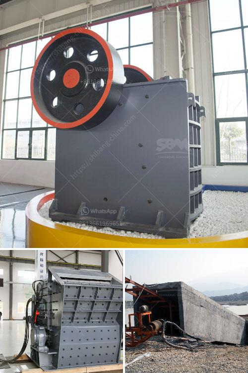

<h3>set up stone crusher plant</h3>
Stone crushing plant is one-stop crushing installation, which can be used for rock crushing, garbage crushing, building materials crushing and other similar operations. Crushing plants may be either fixed or mobile.

A crushing plant has different stations (primary, secondary, tertiary, ...) where different crushing, selection and transport cycles are done in order to obtain different stone sizes, for fixed plant different stages combines together to form a complete stone crushing plant.

Feeding equipment: like vibration feeder or plate type feeder: These machines feed the jaw crusher or impact crusher with the rocks and stones to be crushed.

Crushing equipment: These are the machines where the rocks and stones are crushed. There are different types of crushers for different types of rocks and stones and different sizes of the input and output material. Each plant would incorporate one or several crushing machines depending on the required final material (small stones or sand).

Vibrating Screen: These machines are used to separate the different sizes of the material obtained by the crushers.

Belt Conveyor: These elements are the belts used for transportation of the material from one machine to another during different phases of process.

Raw materials are evenly and gradually conveyed into jaw stone crushing equipment for primary crushing via the hopper of vibrating feeder.

The crushed stone materials are conveyed to crushing plant by belt conveyor for secondary crushing before they are sent to vibrating screen to be separated.

After separating, qualified materials will be taken away as final products, while unqualified materials will be carried back to the stone crushing equipment for recrushing. Customers can classify final products according to different size ranges. All the final products are up to the related standards within and beyond China.

Of course, according to different requirements, customers can adjust the size of their final products from this stone crushing plant. Process of Stone Crushing Plant

Dust is generated during the working process while the dust control units are needed. crushing plant is mainly composed with vibrating feeder, jaw crusher, cone crusher / impact crusher, vibrating screen, belt conveyor and electrical controlling system. Capacity can be 30-1000t/h. For different requirements on finished products sizes also can equip with cone crusher.

The stone crusher plant includes a platform for the inlet nozzle and a platform for the outlet nozzle. There are also platforms for accessing the crusher, integrated in the structure of the hall’s gantry. However, this type of construction is subject to costs. The hard rock stone walls are not cheap to install.

It is advisable to consult with professionals for advice on necessary construction materials and types of walls required for safe and efficient operation. It is also important to consider the costs associated with the excavation. The wider and deeper the excavation, the more expensive the job will be.

Once the plant is set up, the removal of contaminated rock and soil also has a major impact on the capacity of soil to provide suitable conditions for plants. It is advisable to consult with a professional before replacing all natural soil with crushed stone.
<h3>Contact us</h3><ul><li><strong>Whatsapp:&nbsp;<a href="https://wa.me/8613661969651">+8613661969651</a></strong></li><li><a href="https://swt.shibang-china.com/?git&amp;zhl&amp;set up stone crusher plant"><strong>Online Service(chat now)</strong></a></li></ul><h3>Related</h3><ul><li><a href='automated roller conveyors.md'>automated roller conveyors</a></li><li><a href='coal mining prices machines.md'>coal mining prices machines</a></li><li><a href='small ball mill prices in kenya.md'>small ball mill prices in kenya</a></li><li><a href='conveyor belts for mining.md'>conveyor belts for mining</a></li><li><a href='dolomite process peritidal subtidal.md'>dolomite process peritidal subtidal</a></li></ul>