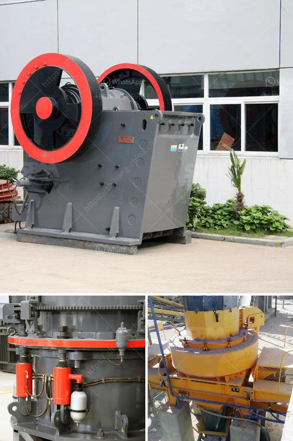

<h3>setting up a 100 tpd cement grinding unit</h3>
Setting up a 100 TPD cement grinding unit can be a complex process. However, with adequate planning and preparation, it can be successful. Here are some key steps to follow when establishing this type of facility:

1. Conduct a market analysis: Before setting up the unit, it is crucial to understand the demand and supply dynamics of the local cement market. Analyze the competitors, current pricing trends, and potential customer base in the region.

2. Secure funding: Estimate the capital required for the project and explore various financing options. This may include seeking a loan from financial institutions or partnering with investors who are interested in the cement industry.

3. Obtain necessary permits and licenses: Consulting local authorities and obtaining the necessary permits and licenses are vital steps in establishing a cement grinding unit. This includes clearance for land acquisition, environmental impact assessments, and adherence to safety regulations.

4. Select a suitable location: Choose a location that allows easy access to raw materials, transportation facilities, and the target market. Availability of power and water supply should also be considered. Additionally, ensure that the location is within the permissible distance from residential areas to comply with noise and pollution standards.

5. Procure machinery and equipment: Identify reliable suppliers for cement grinding machinery and equipment. Seek quotations from multiple suppliers and compare the costs, quality, and after-sales support. Procure necessary machinery like crushers, separators, ball mills, and packing machines to efficiently run the unit.

6. Engage skilled labor: Skilled and experienced personnel are crucial for the smooth functioning of the grinding unit. Hire qualified staff who have expertise in handling the machinery, operating the equipment, and managing the production process.

7. Set up a quality control system: Implementing a robust quality control system is essential to ensure that the produced cement meets the required standards. Develop a quality control team to monitor various stages of production, including checking the raw materials, analyzing the grinding process, and conducting regular tests on the finished product.

8. Establish supply chain networks: Establishing a reliable supply chain network is crucial to ensure the consistent supply of raw materials and the efficient distribution of finished products. Explore partnerships with local suppliers, transporters, and distributors to streamline the logistics operations.

9. Implement safety measures: Prioritize the safety of workers and the integrity of the facility. Ensure proper training on operating the machinery, handling hazardous materials, and following safety protocols. Install safety equipment, such as fire suppression systems and emergency exits, to mitigate the risks associated with cement grinding.

10. Develop a marketing strategy: Develop a comprehensive marketing strategy to create awareness about the newly established grinding unit. This may include participating in industry events, engaging in advertising campaigns, and building relationships with potential customers.

In conclusion, setting up a 100 TPD cement grinding unit requires careful planning and execution. By following these essential steps, one can establish a successful unit that contributes to the local cement industry and meets the growing demand in the market.
<h3>Contact us</h3><ul><li><strong>Whatsapp:&nbsp;<a href="https://wa.me/8613661969651">+8613661969651</a></strong></li><li><a href="https://swt.shibang-china.com/?git&amp;zhl&amp;setting up a 100 tpd cement grinding unit"><strong>Online Service(chat now)</strong></a></li></ul><h3>Related</h3><ul><li><a href='used in cement plant.md'>used in cement plant</a></li><li><a href='mini cement plant for sale in south africa.md'>mini cement plant for sale in south africa</a></li><li><a href='manganese processing plant in india.md'>manganese processing plant in india</a></li><li><a href='limestone powder conveying system.md'>limestone powder conveying system</a></li><li><a href='used grinding mills for sale.md'>used grinding mills for sale</a></li></ul>