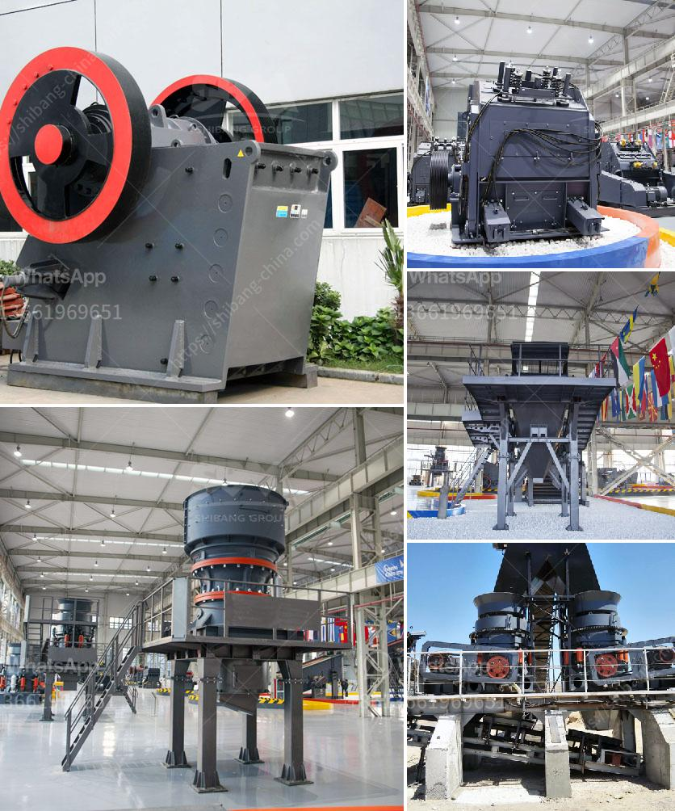

<h3>setup for limestone crusher plant</h3>
Limestone crushing plant configuration is crucial for efficient processing of limestone. Limestone is an important rock material, which is widely used in construction, industrial and agricultural production fields, and so on. As a natural resource, limestone is ideal for various applications due to its relatively low cost and versatility. However, the process of limestone crushing requires a range of equipment, and these considerations must be taken into account when designing a plant.

To ensure proper operation and maximum efficiency, it is recommended to consult a professional in the industry to optimize the design and selection of equipment. However, the general setup for limestone crusher plant will have the following steps. Primary crushing of limestone by a primary jaw crusher. Secondary crushing of limestone using a cone crusher or impact crusher. Final limestone crushing by hammer crusher, ordinary roller crusher, fine crusher or toothed roller crusher.

The production capacity of jaw crusher can reach 800-1000 tons per hour and the cone crusher can produce 240-260 tons per hour. Their crushing stones is highly efficient and the final product is very good in cubical shape. Limestone is rich in resources, and the application value is also very high. Limestone is a kind of building material, which can be used to make cement, glass, lime, calcium carbide, fertilizer, ceramics and other industrial raw materials.

Generally, the machine configuration of the limestone crushing plant should be based on the requirements of the users. When selecting the equipment, the price is a factor for the consideration. However, the equipment quality and after-sales service are also important. Different manufacturers have different production technologies, equipment models and different prices. Users should choose a manufacturer with good reputation, high product quality and excellent after-sales service.

The primary crusher is usually a jaw crusher or impact crusher. The crushed limestone is conveyed to the secondary crusher by a belt conveyor. After the secondary crushing, the limestone is sorted by a vibrating screen. The qualified limestone particles are sent to the storage bin through a bucket elevator. The final limestone material with the required particle size is sent to the sand making machine for shaping and sand making.

In addition to the primary, secondary and tertiary crushers, there are also auxiliary equipment to consider. These include vibrating feeders, belt conveyors, sand washing machines, dust collectors, etc. The purpose of these machines is to ensure smooth and efficient operation of the limestone crushing plant.

In conclusion, the setup for a limestone crusher plant will vary depending on the requirements of the users. It is important to choose a good manufacturer, configure the equipment properly, and ensure proper operation and maintenance to maximize the productivity and efficiency of the plant. A well-designed limestone crushing plant will greatly improve production efficiency and reduce costs, making it an ideal choice for users in the construction and industrial fields.
<h3>Contact us</h3><ul><li><strong>Whatsapp:&nbsp;<a href="https://wa.me/8613661969651">+8613661969651</a></strong></li><li><a href="https://swt.shibang-china.com/?git&amp;zhl&amp;setup for limestone crusher plant"><strong>Online Service(chat now)</strong></a></li></ul><h3>Related</h3><ul><li><a href='dolomite production process.md'>dolomite production process</a></li><li><a href='crusher plant layout.md'>crusher plant layout</a></li><li><a href='crushing machine price in malaysia.md'>crushing machine price in malaysia</a></li><li><a href='crusher plant price komatsu.md'>crusher plant price komatsu</a></li><li><a href='dry process of cement manufacturing.md'>dry process of cement manufacturing</a></li></ul>