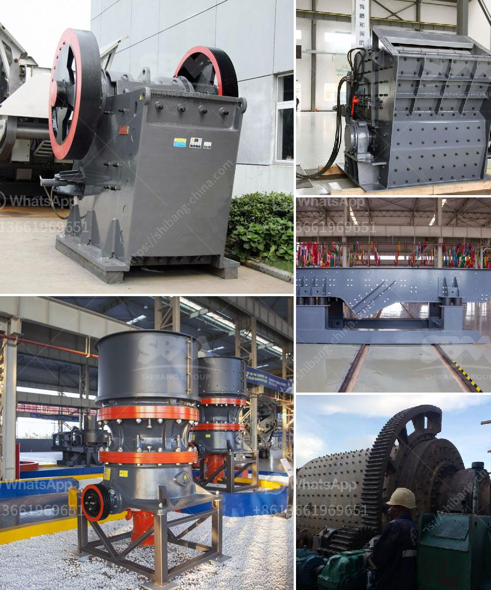

<h3>sewa mesin jaw crusher</h3>
When it comes to crushing rocks or minerals, the jaw crusher is one of the most commonly used and highly efficient options available today. With its high capacity and ability to crush large materials into small, uniform pieces, a jaw crusher can be an invaluable tool in your mining or construction project. However, purchasing a jaw crusher can be costly and may not be the most practical choice for every operation. This is where the option of renting or hiring a jaw crusher comes into play, specifically through companies that offer sewa mesin jaw crusher services.

Sewa mesin jaw crusher, or the option of hiring a jaw crusher, is a viable alternative for those enterprises who don't have the financial means to purchase new equipment or want to try out certain equipment before committing to a long-term purchase. This service provides the opportunity to access top-quality jaw crushers without the burden of ownership, allowing you to focus on your immediate crushing needs.

One of the key advantages of sewa mesin jaw crusher is the flexibility it offers. Since you are not tied down to a fixed investment, you have the freedom to choose the crusher size and specification that suits your specific requirements. Whether you need a jaw crusher with a smaller or larger feed opening, with higher or lower capacity, or even certain special features, you can tailor your rental agreement to get exactly what you need.

Another significant advantage of renting a jaw crusher is the reduced maintenance and upkeep costs. When you rent a jaw crusher, the rental company is responsible for the routine maintenance and repairs, ensuring that the crusher is always in optimal condition. This means you can focus on your core business activities without worrying about the additional costs and time required for maintenance and repairs.

Renting a jaw crusher also offers greater flexibility in terms of duration. Whether you need the jaw crusher for a short-term project or a longer-term operation, most rental companies offer flexible rental contracts that can be tailored to your specific time frame. This allows you to have the equipment for as long as you need it, without having to make a long-term financial commitment.

Furthermore, the rental option of sewa mesin jaw crusher enables you to access cutting-edge technology without the need for a large upfront investment. As technology continues to evolve, renting a jaw crusher allows you to stay ahead by incorporating the latest advancements in your operations. This can contribute to higher productivity, improved efficiency, and ultimately, better profitability.

In conclusion, sewa mesin jaw crusher is a practical and cost-effective solution for businesses in need of crushing equipment. By renting a jaw crusher, you can access high-quality equipment without the burden of ownership, saving you money, time, and resources. With flexible rental options and the assurance of regular maintenance, renting a jaw crusher provides the versatility and convenience required for successful crushing operations. So, consider opting for sewa mesin jaw crusher to meet your crushing needs and propel your business forward.
<h3>Contact us</h3><ul><li><strong>Whatsapp:&nbsp;<a href="https://wa.me/8613661969651">+8613661969651</a></strong></li><li><a href="https://swt.shibang-china.com/?git&amp;zhl&amp;sewa mesin jaw crusher"><strong>Online Service(chat now)</strong></a></li></ul><h3>Related</h3><ul><li><a href='set up stone crusher plant.md'>set up stone crusher plant</a></li><li><a href='bentonite processing plant.md'>bentonite processing plant</a></li><li><a href='prices of iron ore crushers.md'>prices of iron ore crushers</a></li><li><a href='fly ash processing plant for sale.md'>fly ash processing plant for sale</a></li><li><a href='concrete recycling equipment manufacturers.md'>concrete recycling equipment manufacturers</a></li></ul>