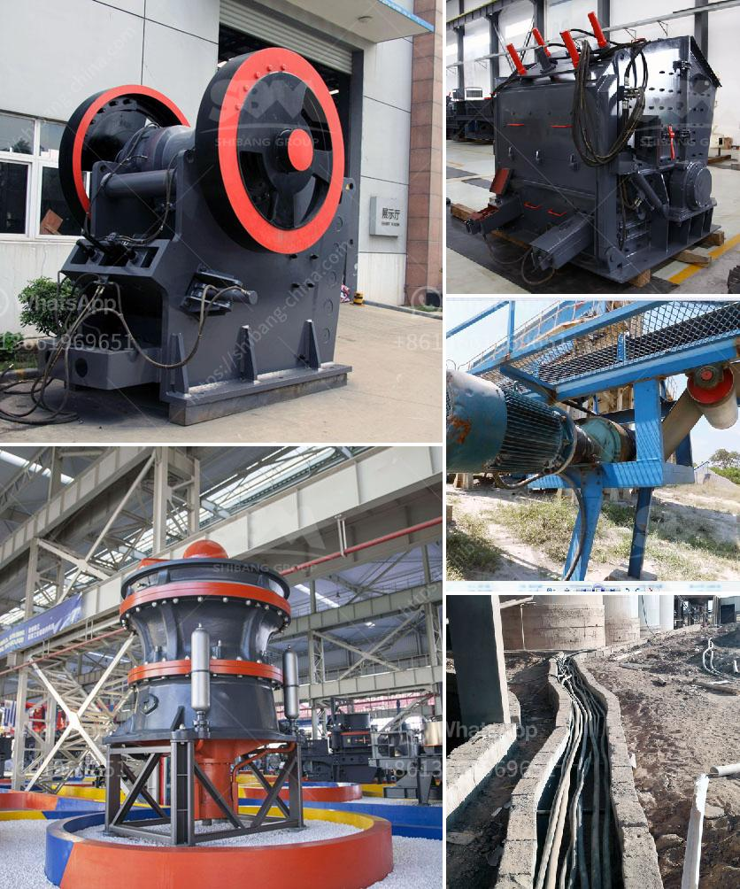

<h3>sewa stone crusher di jakarta</h3>
Growing urbanization and increasing population pressure in Jakarta, the capital city of Indonesia, has resulted in a surge in construction projects. These projects require substantial amounts of building materials, including stones and aggregates. Consequently, the demand for stone crushing machines is increasing as well, leading to the growth of the stone crusher rental market in Jakarta.

Sewa stone crusher di Jakarta, which translates to renting a stone crusher in Jakarta, provides an attractive investment opportunity for businesses in the construction industry. Renting a stone crusher can be strategically beneficial for several reasons:

1. Cost-effective: The rental option allows businesses to save on upfront costs of purchasing equipment. Stone crushers can be pricey, and procuring them may not be feasible for every business. Opting for rental services allows companies to access stone crushers without breaking their budgets and making financial investments that may take years to recover.

2. Versatile: Different construction projects require different types and sizes of stones. By opting for rental services, businesses have the flexibility to choose the most suitable stone crusher for each project. From larger jaw crushers to smaller impact crushers, rental companies offer a wide range of options to meet specific project requirements.

3. Maintenance and repair: Stone crushers require regular maintenance to ensure optimal performance. In the event of any breakdown or malfunction, the responsibility lies with the rental company to provide immediate assistance. This saves businesses from potential downtime, loss of productivity, and additional repair costs.

4. Easy adaptation to project needs: Construction projects in Jakarta vary in scale and duration. Sewa stone crusher di Jakarta offers businesses the freedom to adapt to varying needs without being burdened by the long-term commitment of owning a stone crusher. Rental services allow companies to secure stone crushers for as long as they need without worrying about the costs associated with maintaining idle machines during off-peak periods.

5. Technological advancements: As technology in the stone crushing industry continues to evolve, renting a stone crusher presents an opportunity for businesses to access the latest machinery advancements without the hassle of ongoing upgrades or replacements. Rental companies typically keep their machines up-to-date to cater to the changing needs of their clientele.

While the idea of renting a stone crusher may seem appealing, businesses should carefully consider several factors before making a decision. These factors include the cost-effectiveness, availability, and reputation of rental companies, as well as the terms and conditions of the rental agreement.

In conclusion, sewa stone crusher di Jakarta provides an excellent investment opportunity for businesses in the construction industry. Renting a stone crusher offers companies cost-effective, versatile, and adaptable solutions to meet their project needs. By carefully evaluating rental options and selecting reputable suppliers, businesses can maximize their return on investment and contribute to the ever-growing construction sector in Jakarta.
<h3>Contact us</h3><ul><li><strong>Whatsapp:&nbsp;<a href="https://wa.me/8613661969651">+8613661969651</a></strong></li><li><a href="https://swt.shibang-china.com/?git&amp;zhl&amp;sewa stone crusher di jakarta"><strong>Online Service(chat now)</strong></a></li></ul><h3>Related</h3><ul><li><a href='philippines crushing equipment for sale kenya.md'>philippines crushing equipment for sale kenya</a></li><li><a href='gypsum portland cement retarder manufacturer usa.md'>gypsum portland cement retarder manufacturer usa</a></li><li><a href='limestone grinding mill.md'>limestone grinding mill</a></li><li><a href='raymond mill india price.md'>raymond mill india price</a></li><li><a href='impact crusher discount.md'>impact crusher discount</a></li></ul>