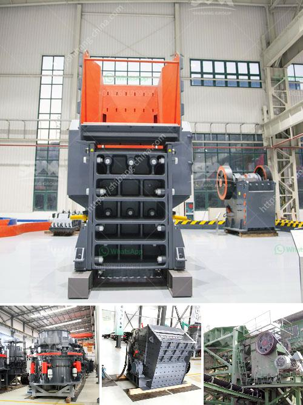

<h3>silica quartz grinding plants bangalore</h3>
Silica quartz grinding plants in Bangalore offer a wide range of applications serving the needs of various industries. With a growing demand for silica quartz, they have expanded their operations and enhanced their production capabilities. These plants are strategically located in close proximity to highways, ensuring easy access to raw materials and efficient transportation for the finished products.

Silica quartz is a chemical compound composed of silicon and oxygen atoms. It is one of the most abundant minerals found on earth. Its unique properties make it an essential raw material in various industries such as glass manufacturing, ceramics, electronics, construction, and even the solar industry. The high demand for these applications has resulted in the establishment of silica quartz grinding plants in Bangalore.

One of the key uses of silica quartz is in glass manufacturing. Silica quartz provides the necessary durability, transparency, and thermal resistance required for making different types of glass. From everyday products like windows and mirrors to specialty glass used in automotive, architectural, and solar applications, silica quartz is a crucial ingredient. The grinding plants in Bangalore ensure the availability of high-quality silica quartz powder that meets the stringent standards of the glass industry.

Ceramic manufacturers also rely heavily on silica quartz for their production. Silica quartz acts as a filler and a bonding agent in ceramic bodies, imparting strength and stability. It also helps control the firing properties of ceramics, enhancing the final product's quality. The grinding plants produce finely ground silica quartz powder, carefully graded to meet specific ceramic requirements.

Silica quartz also finds extensive use in the electronics industry. It is a primary component in the manufacturing of semiconductors and other electronic devices. The grinding plants in Bangalore produce ultra-fine silica quartz powder that is used as a raw material in semiconductor fabrication. The high purity and controlled particle size distribution make this powder ideal for electronic applications.

The construction industry also relies on silica quartz for various applications. It is commonly used as a filler in concrete, providing improved strength, durability, and resistance to chemical attack. Its use in mortars and grouts also ensures better cohesion and adhesion, enhancing the overall structural integrity. The grinding plants in Bangalore produce precisely ground silica quartz powder that meets the requirements of the construction industry.

Lastly, the solar industry is another major consumer of silica quartz. The high purity required for solar-grade silicon makes it a demanding application. Silica quartz grinding plants in Bangalore produce solar-grade silica quartz powder that is used for photovoltaic systems, solar cells, and modules. The plants ensure strict quality control measures to deliver consistently high-quality silica quartz powder for the solar industry.

In conclusion, silica quartz grinding plants in Bangalore are an integral part of various industries. Their efficient operations and ability to produce high-quality silica quartz powder cater to the growing demand in the glass, ceramics, electronics, construction, and solar sectors. These plants play a vital role in sustaining and driving the economy while fulfilling the diverse requirements of different applications.
<h3>Contact us</h3><ul><li><strong>Whatsapp:&nbsp;<a href="https://wa.me/8613661969651">+8613661969651</a></strong></li><li><a href="https://swt.shibang-china.com/?git&amp;zhl&amp;silica quartz grinding plants bangalore"><strong>Online Service(chat now)</strong></a></li></ul><h3>Related</h3><ul><li><a href='7x8 foot ball mills.md'>7x8 foot ball mills</a></li><li><a href='calcite milling equipment for sale.md'>calcite milling equipment for sale</a></li><li><a href='harga mobile crusher 100tph.md'>harga mobile crusher 100tph</a></li><li><a href='coal mill outlet temperature.md'>coal mill outlet temperature</a></li><li><a href='pakistan crusher machine.md'>pakistan crusher machine</a></li></ul>