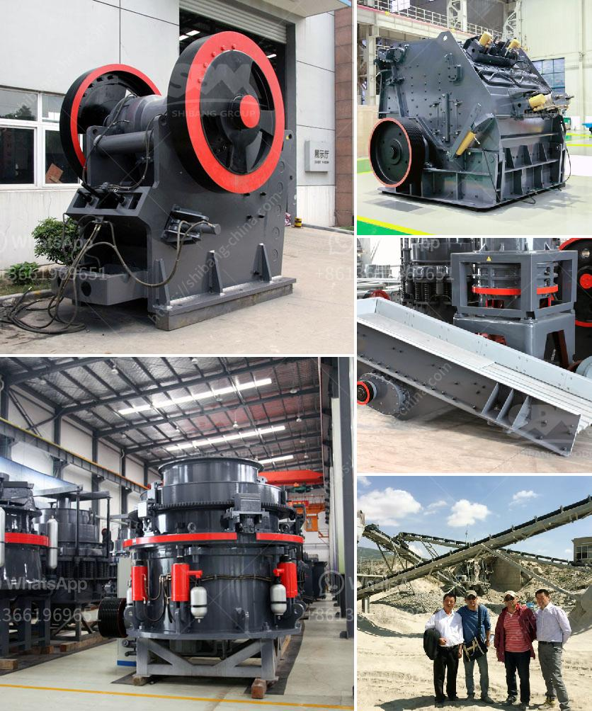

<h3>silica sand crusher machine manufacturin</h3>
Silica sand is a type of sand that is mainly composed of tiny granules of quartz. It is derived from the weathering of quartz-rich rocks or from the decomposition of silica-rich materials such as sandstone. Silica sand is used for various purposes such as construction, glassmaking, and industrial applications. To meet the increasing demand for silica sand, mining companies are investing in advanced technology and machinery to crush silica sand into finer particles for various industries. This is where silica sand crusher machines come into play.

Silica sand crushers are jaw crusher, cone crusher, hammer crusher, and roller crusher. These crushers are highly efficient and high-performance machines that are designed to operate in difficult working conditions and are widely used in mining, construction, and quarrying industries. With the silica sand market becoming more competitive, it is important for manufacturers to invest in advanced technology to ensure the quality and consistency of the final product.

One of the leading manufacturers of silica sand crushers is SBM Machinery. SBM is a professional manufacturer of silica sand crushers in China, and it supplies all kinds of stone crushers, screening, washing machine and grinding mills for silica sand mining, processing plant. SBM has been dedicated in mining technology for several decades. We provide high-quality silica sand crusher machine, which is designed for silica sand processing plant.

One of the unique features of SBM silica sand crusher machine is the hydraulic system that ensures easy adjustment and maintenance. This machine is designed with a modular structure, which allows users to easily replace parts and keep the machine in good working condition. Another advantage of this machine is its low energy consumption and low operation cost. The high-efficiency motor and energy-saving system reduce energy consumption by 30% and operating costs by 70% compared to traditional crushers.

In addition to the hydraulic system and energy-saving features, SBM silica sand crusher machine also has advanced dust removal system. This system effectively removes dust and other impurities from the crushing chamber, ensuring a clean working environment and reducing the risk of respiratory diseases. The machine is also equipped with advanced overload protection system, which automatically stops the machine when it encounters an overload situation, preventing damage to the machine and ensuring safe operation.

SBM silica sand crusher machine is widely used in silica sand crushing plant for crushing quartz, marble, limestone, basalt, chrome, dolomite, feldspar, and other stones and rocks. SBM silica sand crusher machines are exported to India, South Africa ,Pakistan, Saudi Arabia, Nigeria, Kenya, Germany ,libya, Iran, Yemen, Pakistan ,Tajikistan ,Mexico ,Chile, Angola ,Egypt, Indonesia and so on countries.

In conclusion, silica sand crusher machine manufacturing is a highly competitive industry. To gain a competitive advantage, manufacturers invest in advanced technology and machinery to produce superior quality silica sand crushers. SBM Machinery is a professional silica sand crusher machine manufacturer and supplier, offering various types of silica sand crushers for sale. With a dedicated team and advanced technology, SBM Machinery ensures assured quality and reliable performance of their machines.
<h3>Contact us</h3><ul><li><strong>Whatsapp:&nbsp;<a href="https://wa.me/8613661969651">+8613661969651</a></strong></li><li><a href="https://swt.shibang-china.com/?git&amp;zhl&amp;silica sand crusher machine manufacturin"><strong>Online Service(chat now)</strong></a></li></ul><h3>Related</h3><ul><li><a href='roler mill 10 ton per hoursprice.md'>roler mill 10 ton per hoursprice</a></li><li><a href='list of cement plants and their capacities.md'>list of cement plants and their capacities</a></li><li><a href='sand washing machines turkey.md'>sand washing machines turkey</a></li><li><a href='grinding rock into powder.md'>grinding rock into powder</a></li><li><a href='crusher peru price crushing plant.md'>crusher peru price crushing plant</a></li></ul>