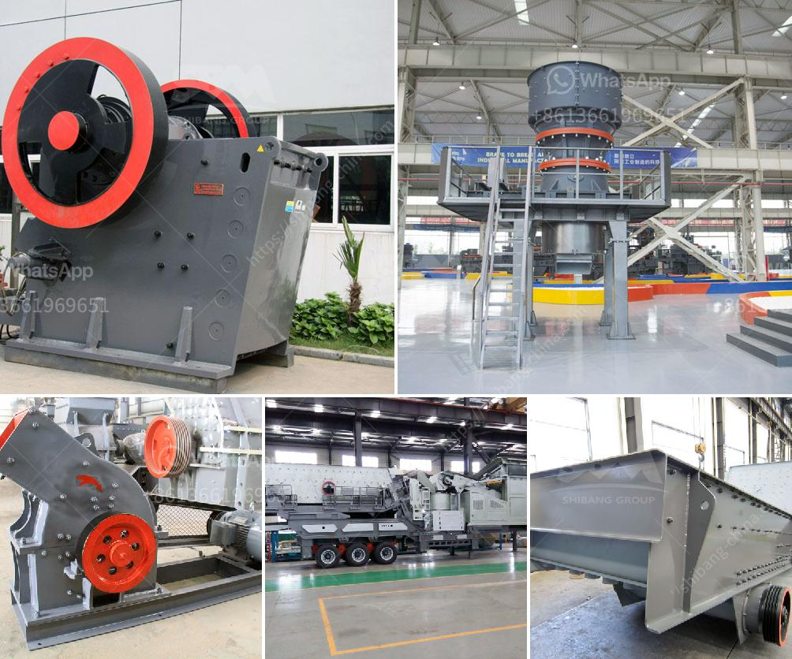

<h3>silica sand manufacturing plant</h3>
Silica sand is one of the most abundant minerals on the earth's crust and is a basic component of soil, sand, and rocks. Silica sand manufacturing plants are crucial for producing silica sand, a key industrial mineral used in various applications such as glassmaking, foundry molds, and abrasives.

A typical silica sand manufacturing plant consists of crushing, screening, and washing the raw material, followed by drying and grading to produce the final product. The manufacturing process starts with extracting the raw material from quarries and mines, where it is then transported to the processing plant.

At the processing plant, the raw material is crushed into smaller pieces using crushers, and then screened to remove any impurities or unwanted materials. The washed and graded silica sand is then dried using various methods such as rotary dryers or fluidized bed dryers to reduce moisture content.

Once dried, the silica sand is further processed to achieve the desired product specifications. This can involve additional washing, scrubbing, or even flotation to remove specific impurities or contaminants if required. The final product is then graded based on size, cleanliness, and other quality parameters.

Silica sand manufacturing plants play a vital role in the glass industry as silica sand is the primary component for making glass. It provides transparency, strength, and durability to the glass products. Furthermore, silica sand is also used in various industrial applications, including construction, ceramics, paint production, and oil and gas drilling.

In conclusion, silica sand manufacturing plants are essential for producing high-quality silica sand used in various industrial applications. Through a series of processes such as crushing, screening, washing, drying, and grading, the raw material is transformed into a valuable product that contributes to various industries. With the growing demand for silica sand, establishing and operating an efficient manufacturing plant is crucial for meeting the market's requirements and ensuring a steady supply of this valuable mineral.
<h3>Contact us</h3><ul><li><strong>Whatsapp:&nbsp;<a href="https://wa.me/8613661969651">+8613661969651</a></strong></li><li><a href="https://swt.shibang-china.com/?git&amp;zhl&amp;silica sand manufacturing plant"><strong>Online Service(chat now)</strong></a></li></ul><h3>Related</h3><ul><li><a href='crushing plant philippines.md'>crushing plant philippines</a></li><li><a href='balls mill for limestone.md'>balls mill for limestone</a></li><li><a href='to do with the stone crusher.md'>to do with the stone crusher</a></li><li><a href='sewa stone crusher di jakarta.md'>sewa stone crusher di jakarta</a></li><li><a href='complete iron ore processing plant cost.md'>complete iron ore processing plant cost</a></li></ul>