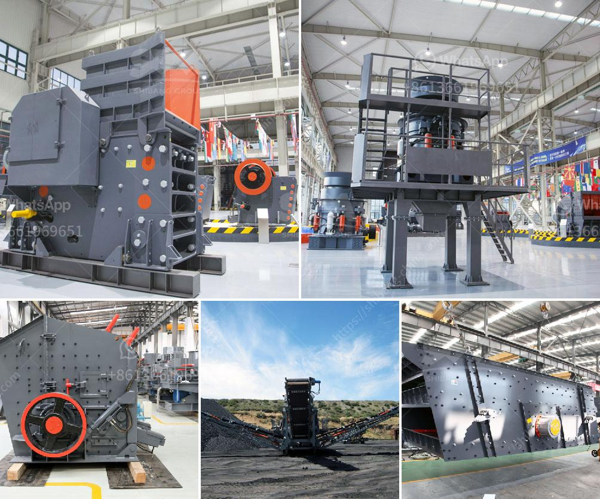

<h3>silica sand price per tonne</h3>
Silica sand is one of the most widely used materials in various industries, particularly in construction and manufacturing. Its abundance and diverse applications make it a highly sought-after commodity in the market. When considering the price of silica sand per tonne, several factors come into play, including supply and demand dynamics, extraction and processing costs, transportation expenses, and the quality of the sand.

The price of silica sand per tonne can vary significantly depending on various market conditions. One of the primary factors influencing the price is the demand for silica sand, which is driven by its use in industries such as construction, glassmaking, foundries, and oil and gas extraction. The construction industry, in particular, accounts for a significant portion of the demand, as silica sand is extensively used in the production of concrete, mortar, and asphalt.

Another factor affecting the price is the availability and accessibility of silica sand deposits. Silica sand is commonly found in coastal areas with abundant beaches or inland regions with deposits formed from ancient rivers and lakes. The accessibility and transportability of these deposits play a role in determining the cost. Areas with readily available silica sand deposits and efficient transportation infrastructure tend to have lower prices.

Extraction and processing costs also contribute to the price of silica sand per tonne. The process of extracting silica sand involves mining and washing the sand to remove impurities such as clay and organic matter. This process requires heavy machinery and energy inputs, which can increase the production costs. Additionally, the washing process involves using water resources, and the availability and cost of water in a region can affect the price of silica sand.

Quality is another important factor when considering the price of silica sand. Different applications require varying levels of purity and grain size. High-quality silica sand with low impurities and well-rounded grains is typically more expensive due to its suitability for specialized applications such as glass production. On the other hand, lower-quality silica sand with higher impurities may be more affordable and suitable for applications like construction.

The price of silica sand may also be influenced by external factors such as environmental regulations and global market trends. Regulatory measures related to mining practices, water usage, and waste management can increase the production costs and, consequently, the price per tonne. Similarly, global factors such as changes in supply and demand, market competition, and economic conditions can impact the overall price of silica sand.

In conclusion, the price of silica sand per tonne is subject to various factors, including supply and demand dynamics, extraction and processing costs, transportation expenses, and the quality of the sand. As a versatile material used in numerous industries, the demand for silica sand is significant, influencing its market price. The availability and accessibility of deposits, extraction and processing costs, and quality specifications further contribute to the price variations. Keeping track of these factors is essential for both buyers and sellers to make informed decisions regarding silica sand procurement.
<h3>Contact us</h3><ul><li><strong>Whatsapp:&nbsp;<a href="https://wa.me/8613661969651">+8613661969651</a></strong></li><li><a href="https://swt.shibang-china.com/?git&amp;zhl&amp;silica sand price per tonne"><strong>Online Service(chat now)</strong></a></li></ul><h3>Related</h3><ul><li><a href='stone crushers in veracruz.md'>stone crushers in veracruz</a></li><li><a href='mobile crusher japan.md'>mobile crusher japan</a></li><li><a href='used stone crusher for sale in dubai.md'>used stone crusher for sale in dubai</a></li><li><a href='quarry crushing line.md'>quarry crushing line</a></li><li><a href='mini crusher mineral processing plants sweden.md'>mini crusher mineral processing plants sweden</a></li></ul>