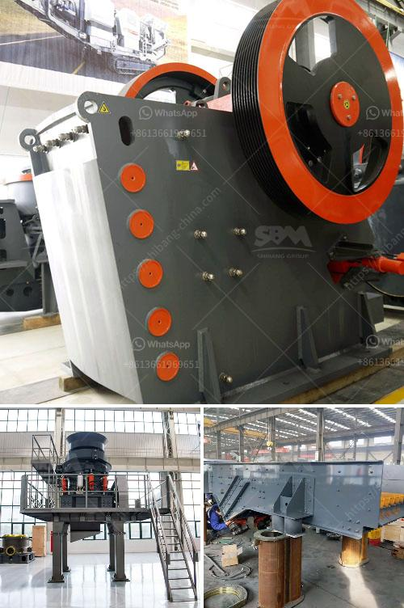

<h3>silica sand washing dry process</h3>
Silica sand is a valuable resource used widely in various industries, including construction, glass manufacturing, and oil and gas production. With the increasing demand for high-quality silica sand, more and more companies are starting to invest in silica sand washing and processing plants to produce high-purity silica sand.

One of the processes commonly used to refine silica sand is washing. This process removes impurities such as clay, iron oxides, and organic matter, leaving behind clean, white silica sand with a high silica content. Traditionally, silica sand washing has been done using water and chemicals to create a slurry that is then pumped and separated through various mechanical processes.

However, in recent years, a dry process for silica sand washing has emerged as an alternative to water-based washing. This dry process offers several advantages over traditional water-based washing.

Firstly, the dry process eliminates the need for large quantities of water. Water is a precious resource, and with concerns about water scarcity and environmental impact, conserving water is crucial. The dry process significantly reduces water consumption compared to traditional washing methods, making it a more sustainable option.

Secondly, the dry process requires fewer chemicals. Water-based washing typically involves the use of chemicals to create a slurry and separate impurities from the silica sand. With the dry process, the need for chemicals is greatly reduced, resulting in a more environmentally friendly and cost-effective method.

Moreover, the dry process offers faster processing times. Traditional washing methods can take several hours or even days to complete, depending on the size of the operation and the quantity of silica sand being processed. In contrast, the dry process is faster, allowing for quicker turnaround times and increased productivity.

Furthermore, the dry process produces a higher-quality product. Water-based washing can sometimes result in residual impurities or the reintroduction of impurities during the separation process. The dry process eliminates the risk of contamination from water or chemicals, ensuring a purer and more consistent silica sand product.

Despite these advantages, there are a few challenges associated with the dry process for silica sand washing. One challenge is the generation of dust. Dry processing can create airborne dust particles, which can be a health and safety concern for workers. However, this issue can be mitigated through proper engineering controls and the use of dust suppression systems.

In conclusion, the dry process for silica sand washing is an innovative and sustainable alternative to traditional water-based washing methods. It reduces water consumption, minimizes the use of chemicals, and offers faster processing times, all while producing a higher-quality product. As the demand for high-purity silica sand continues to grow, companies should consider investing in dry processing plants to meet market requirements and minimize their environmental footprint.
<h3>Contact us</h3><ul><li><strong>Whatsapp:&nbsp;<a href="https://wa.me/8613661969651">+8613661969651</a></strong></li><li><a href="https://swt.shibang-china.com/?git&amp;zhl&amp;silica sand washing dry process"><strong>Online Service(chat now)</strong></a></li></ul><h3>Related</h3><ul><li><a href='low cost gold mining equipment.md'>low cost gold mining equipment</a></li><li><a href='calcium carbonate milling machine.md'>calcium carbonate milling machine</a></li><li><a href='used portable crusher for sale in germany.md'>used portable crusher for sale in germany</a></li><li><a href='list of manufacturers vertical milling machines in europe.md'>list of manufacturers vertical milling machines in europe</a></li><li><a href='how to make silica rock pebles in ball mill.md'>how to make silica rock pebles in ball mill</a></li></ul>