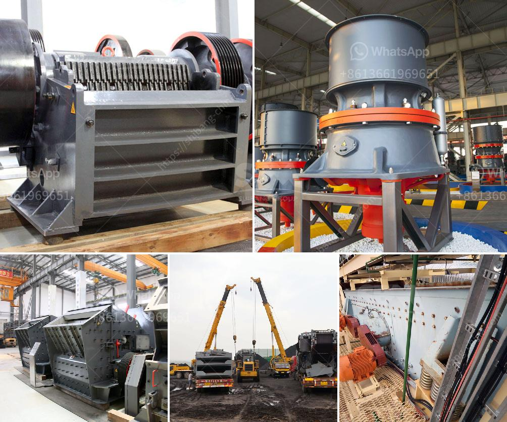

<h3>silica sand washing machine</h3>
Silica sand is a key ingredient in the production of glassware and ceramics, and is widely used in the construction industry as a raw material for concrete and mortar. Without silica sand, many of the products we rely on in our daily lives would not exist. However, to make use of silica sand in these applications, it first needs to be processed to remove impurities and ensure it meets the required specifications. This is where silica sand washing machines come into play.

Silica sand washing machines are designed to remove any dirt, dust, or impurities present in the silica sand to obtain a clean, pure form of sand. These machines are ideal for washing, dewatering, and classification of silica sand, which can be used for various applications, such as glass making, construction, and hydraulic fracturing.

One of the main advantages of silica sand washing machines is their ability to remove unwanted impurities, including clay particles and organic matter, which can affect the quality and performance of the final product. By washing the silica sand, these machines ensure that the resulting sand is free from any impurities, allowing it to be used with confidence in various industries.

The process of silica sand washing involves several steps. Firstly, the silica sand is fed into the sand washing machine through a vibrating feeder. Next, it is conveyed to the trommel screen, where it is washed and classified. The water and sand mixture is then pumped into the hydrocyclone, where the sand is separated from the water and any remaining impurities. The clean silica sand is then dewatered, dried, and ready for use.

One of the key features of modern silica sand washing machines is their ability to efficiently remove impurities while minimizing water consumption. Water scarcity is a growing concern in many parts of the world, and the use of water in industrial processes needs to be optimized. Silica sand washing machines are designed to use as little water as possible while ensuring that the sand is adequately cleaned.

In addition, some silica sand washing machines come with advanced technologies, such as automatic controls and monitoring systems, to optimize the washing process. These features allow for greater precision and efficiency in the removal of impurities, ensuring that the final product meets the required standards.

Overall, silica sand washing machines play a crucial role in the production of clean sand for various industries. They remove unwanted impurities, ensuring that the resulting sand can be used with confidence in applications such as glass making and construction. Moreover, the advanced features of these machines allow for greater efficiency and water conservation, addressing environmental concerns. As the demand for clean silica sand continues to grow, the importance of silica sand washing machines in the industry cannot be overstated.
<h3>Contact us</h3><ul><li><strong>Whatsapp:&nbsp;<a href="https://wa.me/8613661969651">+8613661969651</a></strong></li><li><a href="https://swt.shibang-china.com/?git&amp;zhl&amp;silica sand washing machine"><strong>Online Service(chat now)</strong></a></li></ul><h3>Related</h3><ul><li><a href='10 allis chalmers jaw crusher.md'>10 allis chalmers jaw crusher</a></li><li><a href='three quarter stone machine.md'>three quarter stone machine</a></li><li><a href='clay processing clay processing south africa.md'>clay processing clay processing south africa</a></li><li><a href='gypsum ball mill manufacturing machine.md'>gypsum ball mill manufacturing machine</a></li><li><a href='mining rental equipment south africa.md'>mining rental equipment south africa</a></li></ul>