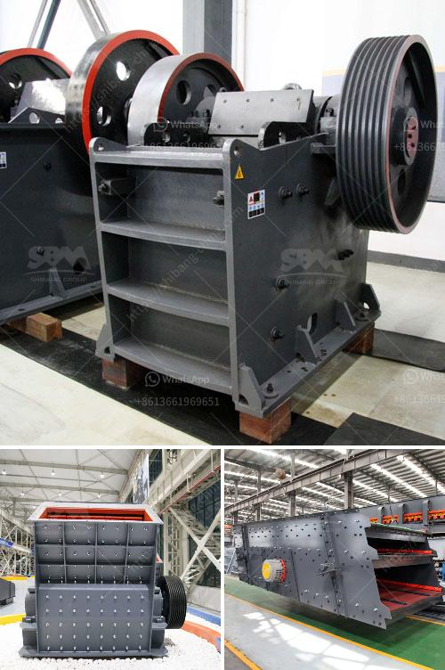

<h3>single stage hammer crusher hot sale</h3>
With the development of construction industry, the demand for single stage hammer crusher is increasing day by day. Single stage hammer crusher market will show prosperous development trend in the future. In recent years, the mining industry has been developing rapidly due to the continuous expansion of the scale of mining enterprises. Single stage hammer crusher is an ideal equipment for crushing brittle materials such as limestone, coal, shale, gypsum, and coal gangue. It is necessary to adjust the hammerhead and rotor gap to meet various specifications of materials. The hot sale of single stage hammer crusher in the market indicates its tremendous market potential.

With the further development of urbanization, the high-quality sand and stone aggregate is in short supply, which drives the mining machinery industry to develop rapidly. The requirements for equipment performance and automation level are increasing. Single stage hammer crusher perfectly combines the advantages of hammer crusher and impact crusher, which helps it overcome the disadvantages of both. It is suitable for crushing medium-hard and brittle materials, such as limestone, coal, and coal gangue. The compressive strength of the materials to be crushed should not exceed 150 MPa.

The single stage hammer crusher features with high production capacity, large crushing ratio, less investment cost, reliable performance, and easy maintenance. It can be used for crushing various medium hard and brittle materials, such as limestone, coal, and other materials in cement, metallurgy, chemical, construction, and other industries. Its final product size is adjustable and the discharge opening can be adjusted within the range of 3-150mm.

The single stage hammer crusher has the advantages of large feeding size, high crushing ratio, simple process, low operating cost, and excellent product size. It has received favorable feedback from customers. Recently, a customer from Mongolia purchased a single stage hammer crusher for processing coal. Combined with the requirements of the customer, the hammer crusher has excellent performance and is cost-effective. It is well received by customers.

To sum up, single stage hammer crusher hot sale has a promising development prospect. It has been widely used in mining, cement, coal, metallurgy, building materials, highway, and construction industries. Single stage hammer crusher is suitable for crushing limestone, coal, and other soft materials with compressive strength less than 200MPa. For example, gypsum, limestone, and clay can be crushed by single stage hammer crusher to produce a final product with different fineness to meet different needs.

In conclusion, single stage hammer crusher hot sale with 300-500 words portrays the market demand and application of single stage hammer crusher. It highlights the advantages, features, and performance of the crusher, making it a hot sale in the market. Single stage hammer crusher will continue to be popular and help meet the increasing demands of the construction industry.
<h3>Contact us</h3><ul><li><strong>Whatsapp:&nbsp;<a href="https://wa.me/8613661969651">+8613661969651</a></strong></li><li><a href="https://swt.shibang-china.com/?git&amp;zhl&amp;single stage hammer crusher hot sale"><strong>Online Service(chat now)</strong></a></li></ul><h3>Related</h3><ul><li><a href='gold wash plant machine in ghana.md'>gold wash plant machine in ghana</a></li><li><a href='cost of cement manufacturing plant.md'>cost of cement manufacturing plant</a></li><li><a href='mobile jaw crusher with rotary screen.md'>mobile jaw crusher with rotary screen</a></li><li><a href='50 tpd mini cement plant task cost in india.md'>50 tpd mini cement plant task cost in india</a></li><li><a href='pebbles aggregate making machine.md'>pebbles aggregate making machine</a></li></ul>