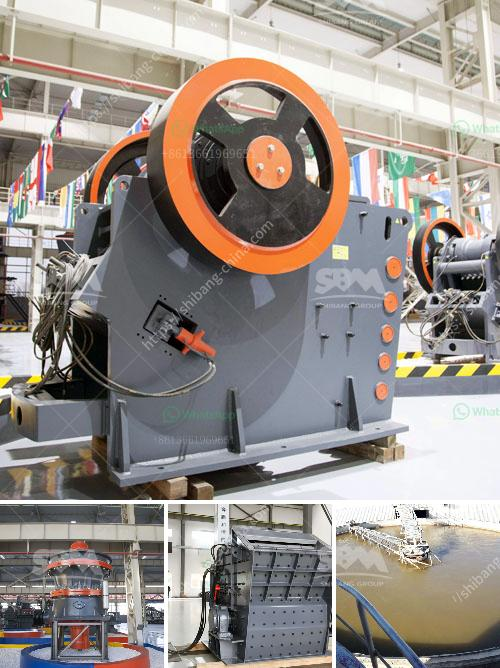

<h3>size of ball mill with cspacity 280 tph</h3>
The size of a ball mill plays a crucial role in determining the efficiency and power requirements of the milling process. Given the capacity of the ball mill, the overall size can be determined. However, the design of the mill also influences the required size of the ball mill, which will ultimately be used to ensure optimal conditions are achieved during grinding.

In the case of a ball mill with a capacity of 280 tph, the general design considerations are as follows. The required size of the ball mill is directly proportional to its capacity. The mill capacity utilizes the grinding media surface area, which determines the potential grinding efficiency. A larger ball mill size can enhance grinding efficiency and capacity, resulting in a higher production rate.

First, it is important to consider the desired product size. The particle size distribution of the final product is a fundamental factor that affects the selection of ball mill size. By controlling the particle size distribution through the mill, the desired product specifications can be achieved.

Another crucial factor to consider is the feed size. The feed material entering the ball mill is usually coarse, and it needs to undergo multiple grinding stages to achieve the desired product size. Therefore, the initial feed size determines the size reduction required and, consequently, the size of the ball mill. The larger the feed size, the larger the mill size required to achieve the desired product specifications efficiently.

Additionally, the hardness and abrasiveness of the feed material need to be considered. Materials with a high hardness and abrasiveness will require a more robust mill design and more durable grinding media to withstand the grinding forces. Therefore, the mill size will also vary based on the material characteristics.

The rotational speed of the ball mill also affects its size. Higher rotational speeds result in greater kinetic energy, increasing the impact and grinding power. However, too high a rotational speed may lead to excessive wear and inefficient grinding. Therefore, the size of the ball mill should be selected considering an optimal rotational speed, which can provide the required grinding power without compromising grinding efficiency.

In conclusion, the size of a ball mill with a capacity of 280 tph should be carefully selected based on various design considerations. Factors such as the desired product size, feed size, material characteristics, and rotational speed all play a vital role in determining the ideal mill size. By optimizing these factors, the ball mill can efficiently achieve the desired grinding performance and production rate, ensuring cost-effective operation in the milling process.
<h3>Contact us</h3><ul><li><strong>Whatsapp:&nbsp;<a href="https://wa.me/8613661969651">+8613661969651</a></strong></li><li><a href="https://swt.shibang-china.com/?git&amp;zhl&amp;size of ball mill with cspacity 280 tph"><strong>Online Service(chat now)</strong></a></li></ul><h3>Related</h3><ul><li><a href='200 tph crusher plant.md'>200 tph crusher plant</a></li><li><a href='puzzolana stone crusher 100tph.md'>puzzolana stone crusher 100tph</a></li><li><a href='how pyrite mined and processed.md'>how pyrite mined and processed</a></li><li><a href='cobalt concentrate processing equiopment manufacturers.md'>cobalt concentrate processing equiopment manufacturers</a></li><li><a href='crushing and screening market in india.md'>crushing and screening market in india</a></li></ul>