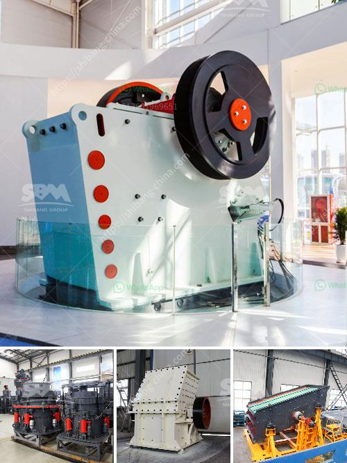

<h3>size pe 600x900 jaw crusher</h3>
The PE 600x900 jaw crusher is a popular option for large-scale crushing applications. It utilizes the very latest technology and has a great capacity to crush tons of hard rock ore and other materials efficiently. The jaw crusher is a great investment in terms of time savings and increased productivity.

The size pe 600x900 jaw crusher is one of the most commonly used primary crushers in the mining industry. It has a wide range of applications and is capable of crushing various materials with compressive strength up to 320MPa. This machinery is highly versatile and can be used for a wide range of operations, such as mining, road construction, building material production, and much more.

One of the key features of the PE 600x900 jaw crusher is its large feed opening size of 600 mm x 900 mm. This allows the machine to handle larger rocks and crush them down to smaller sizes to be processed further. The wide feed opening also ensures that there is a minimum blockage of material during the crushing process, resulting in higher efficiency and reduced downtime.

The jaw crusher is equipped with a powerful motor and is capable of producing high-quality end products. It has a maximum capacity of 70-150 tons per hour and is easy to operate and maintain. The machine has a simple structure, ensuring quick and easy maintenance, minimizing downtime and increasing productivity.

Another advantage of the PE 600x900 jaw crusher is its adjustable discharge setting. This feature allows you to adjust the size of the end product according to your specific needs. Whether you require coarser or finer materials, this jaw crusher can accommodate your requirements effortlessly.

Furthermore, the jaw crusher is designed with a durable and rugged construction. It is built to withstand heavy-duty applications and has a long lifespan. This makes it a cost-effective option in the long run, as it reduces the need for frequent replacements and repairs.

In conclusion, the PE 600x900 jaw crusher is a versatile and powerful option that offers high productivity and efficiency, making it an ideal choice for various crushing applications. Its large feed opening size, adjustable discharge setting, and durable construction make it a reliable and cost-effective solution. Whether you are in the mining industry or involved in road construction, this jaw crusher will exceed your expectations and provide you with outstanding results.
<h3>Contact us</h3><ul><li><strong>Whatsapp:&nbsp;<a href="https://wa.me/8613661969651">+8613661969651</a></strong></li><li><a href="https://swt.shibang-china.com/?git&amp;zhl&amp;size pe 600x900 jaw crusher"><strong>Online Service(chat now)</strong></a></li></ul><h3>Related</h3><ul><li><a href='buy mobile crusher.md'>buy mobile crusher</a></li><li><a href='raymond mill mumbai and africa.md'>raymond mill mumbai and africa</a></li><li><a href='mobile crusher 100tph.md'>mobile crusher 100tph</a></li><li><a href='price of grinder machine in malaysia.md'>price of grinder machine in malaysia</a></li><li><a href='stone crusher company russia.md'>stone crusher company russia</a></li></ul>