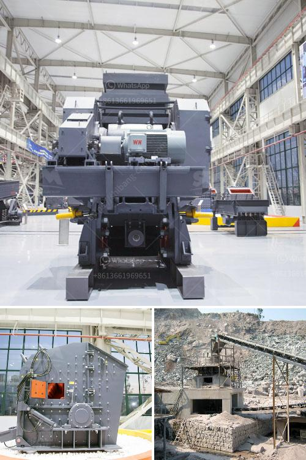

<h3>slag crusher machine india</h3>
India produces vast amounts of industrial waste every year, with steel slag accounting for a significant portion. Undoubtedly, this presents a substantial challenge for the country's waste management systems. However, with the emergence of the slag crusher machine India has found a cost-effective solution for the disposal of industrial waste.

Slag is a byproduct of the steel manufacturing process. During the production of steel, various impurities such as silicon, sulfur, and phosphorus are removed from iron ore. These impurities combine to form slag, which is generally dumped as waste. Large piles of slag collect in steel plants, posing a threat to the environment and human health if not managed properly.

To tackle this issue, the concept of slag crusher machine India was introduced. This machine is designed to reduce large-sized lumps of slag into smaller particles. By crushing the slag, it becomes possible to recover metal residues and allow for their reuse or recycling. Moreover, the smaller particles can be utilized as construction materials, thus reducing the demand for natural resources.

One of the main advantages of using a slag crusher machine in India is its ability to reduce the overall cost of waste disposal. A large number of steel plants are located in areas where land is a valuable resource. Traditional methods of waste disposal, such as landfills or using the slag for backfilling, require a substantial amount of land. The use of a slag crusher machine eliminates the need for additional land, providing cost savings to steel manufacturers.

Furthermore, the use of a slag crusher machine helps in reducing the environmental impact caused by the accumulation of slag. When left unmanaged, slag can leach harmful substances into the soil and contaminate water sources. The release of such pollutants can have detrimental effects on the surrounding ecosystem. By crushing the slag, the potential for environmental contamination is significantly reduced, promoting a cleaner and safer environment.

In addition to environmental benefits, the slag crusher machine India also offers economic advantages. The recovered metal residues can be sold or reused, providing an additional revenue stream for the steel industry. Moreover, the use of crushed slag as a construction material reduces the demand for natural resources, resulting in cost savings for infrastructure development.

The slag crusher machine India is manufactured by reputable manufacturers who are committed to offering quality products. They understand the specific requirements of the steel industry and design the machines accordingly. These machines are durable, efficient, and low maintenance, ensuring a long lifespan and maximum productivity.

In conclusion, the slag crusher machine India has emerged as an effective solution for the disposal of industrial waste. It not only reduces the overall cost of waste management but also provides environmental and economic benefits. By crushing the slag, valuable metal residues can be recovered, reducing the demand for natural resources and promoting sustainability. The use of this machine showcases India's commitment to efficient waste management and creating a cleaner and greener future.
<h3>Contact us</h3><ul><li><strong>Whatsapp:&nbsp;<a href="https://wa.me/8613661969651">+8613661969651</a></strong></li><li><a href="https://swt.shibang-china.com/?git&amp;zhl&amp;slag crusher machine india"><strong>Online Service(chat now)</strong></a></li></ul><h3>Related</h3><ul><li><a href='second hand mobile coal washing plant.md'>second hand mobile coal washing plant</a></li><li><a href='gold hammer crusher.md'>gold hammer crusher</a></li><li><a href='cost of mini pulvrizers crusher.md'>cost of mini pulvrizers crusher</a></li><li><a href='vertical grinder for spindle.md'>vertical grinder for spindle</a></li><li><a href='i want a powder grinding mill for sale.md'>i want a powder grinding mill for sale</a></li></ul>