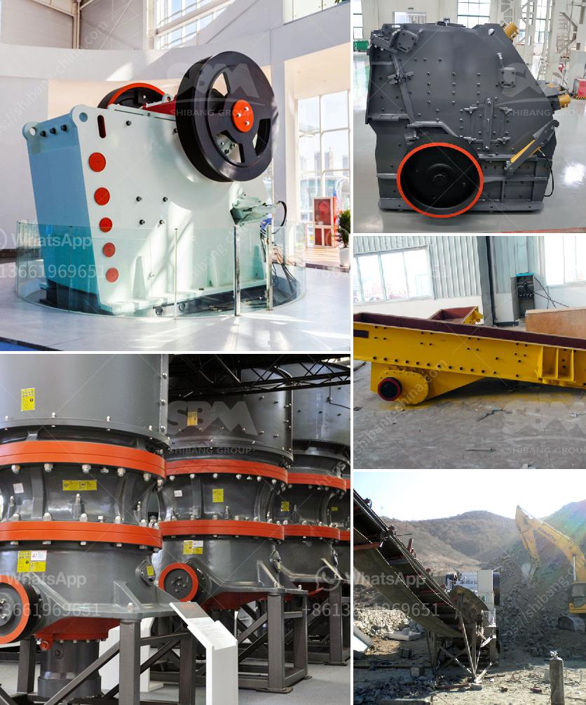

<h3>slag crushing machine</h3>
Slag is a by-product of industrial processes such as smelting and steelmaking. It is usually a mixture of metal oxides and silicon dioxide, along with traces of other elements. While slag is an unwanted waste material for many industries, it can actually be recycled and used for various purposes, thanks to the invention of slag crushing machines.

A slag crushing machine is a device that is designed to crush and pulverize large chunks of slag into smaller pieces. These machines usually involve a hopper, a conveyor belt, and a sturdy crushing mechanism. The crushed slag particles are then discharged from the machine at a desired size.

The process of crushing slag allows for the separation of metal contaminants and other impurities from the slag material. This not only helps in recovering valuable metals but also reduces the environmental impact of slag disposal. By crushing and recycling slag, industries can save resources, reduce landfill waste, and minimize their carbon footprint.

Furthermore, crushed slag can be used as a raw material in different industries. For example, crushed slag can be mixed with cement to make it more durable and resistant to corrosion. It can also be used as an aggregate in road construction or as filler material in asphalt mixtures. By using slag as an alternative to traditional raw materials, industries can conserve natural resources and contribute to sustainable development.

1. Efficient separation: The crushing process separates the metal contaminants from the slag material, allowing for the recovery of valuable metals such as iron, steel, and copper. This increases the economic value of the slag and reduces the demand for virgin raw materials.

2. Environmental benefits: By recycling and reusing slag, industries can reduce their impact on the environment. The production of cement, for instance, is a major source of greenhouse gas emissions. By replacing some of the cement with crushed slag, industries can reduce their carbon footprint and contribute to climate change mitigation.

3. Cost-effective solution: Slag crushing machines are designed to be efficient and cost-effective. The initial investment may be higher compared to traditional crushing equipment, but the long-term savings and benefits outweigh the initial costs. Industries can save on raw material expenses, landfill fees, and transportation costs.

In conclusion, slag crushing machines are a must-have industrial equipment for any industry dealing with slag waste. These machines not only help in recycling and reusing slag but also provide valuable environmental and economic benefits. By crushing slag, industries can reduce their environmental impact, save resources, and contribute to a more sustainable future. Therefore, it is imperative for industries to invest in reliable and efficient slag crushing machines.
<h3>Contact us</h3><ul><li><strong>Whatsapp:&nbsp;<a href="https://wa.me/8613661969651">+8613661969651</a></strong></li><li><a href="https://swt.shibang-china.com/?git&amp;zhl&amp;slag crushing machine"><strong>Online Service(chat now)</strong></a></li></ul><h3>Related</h3><ul><li><a href='coal processing plant crusher.md'>coal processing plant crusher</a></li><li><a href='hammer mill clays price.md'>hammer mill clays price</a></li><li><a href='different between the mill and hammer crusher.md'>different between the mill and hammer crusher</a></li><li><a href='stone crusher machine in india.md'>stone crusher machine in india</a></li><li><a href='clay ball mills south africa.md'>clay ball mills south africa</a></li></ul>