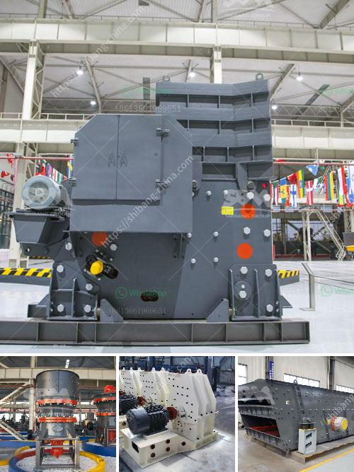

<h3>slag crushing plant</h3>
In various industrial processes, slag is generated as a byproduct. It is a mixture of various compounds and impurities, which occur during the smelting process of different ores. Such byproducts are typically disposed of as waste, causing environmental pollution and wastage of valuable resources. However, technological advancements have made it possible to reuse these byproducts efficiently. This is where the importance of a slag crushing plant comes into play.

A slag crushing plant is a machine that helps in the crushing and screening of large slag aggregates. This machine helps in the recovery and reuse of valuable metallics such as iron, steel, and aluminum, and also helps in the recovery of other valuable minerals from the waste slag. Once deemed useless, slag is now effectively and efficiently utilized as a valuable resource.

The process within a slag crushing plant involves various methods of sorting and screening to segregate different-sized particles and contaminants. The primary crusher is responsible for reducing the size of the slag into smaller, manageable pieces or granules. The secondary crushers further reduce the size into finer granules. The vibrating screens ensure accurate segregation of the crushed material as per its size and composition.

There are several advantages to using a slag crushing plant. Firstly, it promotes sustainable development by reducing the environmental impact caused by the disposal of slag. It prevents the accumulation of these waste materials in landfills, which helps in maintaining a greener and cleaner environment.

Secondly, a slag crushing plant offers economic benefits. By recovering valuable minerals from slag, industries can save on raw material costs and reduce their dependence on mining. These plants also contribute to the circular economy by transforming waste materials into reusable products, creating a self-sustaining system.

Moreover, slag crushing plants aid in the conservation of natural resources. By using slag as a substitute for raw materials, the demand for quarrying and mining activities reduces. This conservation of resources helps in preserving delicate ecosystems and minimizing the ecological damage caused by excessive extraction.

Another significant advantage of a slag crushing plant is the recovery of metallics. Slag often contains valuable metallic elements like iron, steel, or aluminum, which can be purified and reused. Through efficient crushing and separation technologies, these metals can be extracted and reused in various industries, reducing the need for additional mining or extraction activities.

Overall, a slag crushing plant plays a crucial role in transforming slag from waste material to a valuable resource. By reducing environmental pollution, promoting sustainable development, conserving natural resources, and recovering valuable metallics, these plants lay the foundation for a greener and more efficient industrial sector.

In conclusion, the benefits of a slag crushing plant are undeniable. It not only contributes to environmental protection but also aids in economic development and resource conservation. Investing in a slag crushing plant is a wise decision for industries looking to streamline their operations and contribute to a sustainable future.
<h3>Contact us</h3><ul><li><strong>Whatsapp:&nbsp;<a href="https://wa.me/8613661969651">+8613661969651</a></strong></li><li><a href="https://swt.shibang-china.com/?git&amp;zhl&amp;slag crushing plant"><strong>Online Service(chat now)</strong></a></li></ul><h3>Related</h3><ul><li><a href='stone medina stone mobile crusher.md'>stone medina stone mobile crusher</a></li><li><a href='carbonate from barite manufacturing process.md'>carbonate from barite manufacturing process</a></li><li><a href='rock crusher in europe.md'>rock crusher in europe</a></li><li><a href='mica powder mill malaysia.md'>mica powder mill malaysia</a></li><li><a href='machine price list ball mill for silica sand.md'>machine price list ball mill for silica sand</a></li></ul>