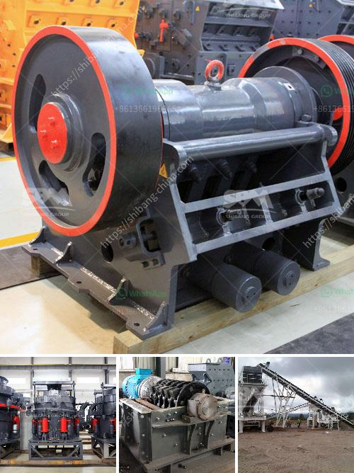

<h3>slag drying and grinding technique india crusher</h3>
Slag is a byproduct of the metal smelting process and is widely used as a supplementary cementitious material in the construction industry. However, before it can be used as a cement replacement, it needs to be dried and ground into a fine powder. This is where the slag drying and grinding technique comes into play.

In India, there are several crushers and grinding mills that can produce high-quality slag powder by drying and grinding slag. These machines have been widely used in various industries, such as construction, metallurgy, mining, and so on. With their innovative designs and advanced technology, these crushers and grinding mills ensure efficient and precise processing of slag.

The first step in the slag drying and grinding technique is the drying of slag. The moisture content of slag is usually high due to its composition. To reduce the moisture content, industrial dryers are used. These dryers utilize hot air to evaporate the moisture from the slag, resulting in a dry material that is easier to grind.

Once the slag is dried, it is then sent to a grinding mill for further processing. The grinding mill, also known as a pulverizer, is specifically designed to grind the dried slag into a fine powder. This powder can then be used as a replacement for cement in various applications.

The grinding technique used in India involves the use of vertical roller mills or VRM. These mills are highly efficient and can produce a high-quality slag powder. The VRM technology ensures precise control over the grinding process, resulting in a consistent and uniform particle size distribution.

Moreover, the use of VRM technology in slag grinding reduces energy consumption and carbon emissions, making it an environmentally friendly option. This technique also offers better resource utilization, as it enables the extraction of valuable metals from the slag.

In conclusion, the slag drying and grinding technique in India plays a crucial role in the efficient and sustainable utilization of slag as a cement replacement material. The use of crushers and grinding mills ensures the production of high-quality slag powder, which can be used in various industries. By adopting this technique, India can contribute to reducing waste and minimizing the environmental impact of the metal smelting process.
<h3>Contact us</h3><ul><li><strong>Whatsapp:&nbsp;<a href="https://wa.me/8613661969651">+8613661969651</a></strong></li><li><a href="https://swt.shibang-china.com/?git&amp;zhl&amp;slag drying and grinding technique india crusher"><strong>Online Service(chat now)</strong></a></li></ul><h3>Related</h3><ul><li><a href='ball mills for large mining.md'>ball mills for large mining</a></li><li><a href='calcite grinding machine manufacturer in udaipur.md'>calcite grinding machine manufacturer in udaipur</a></li><li><a href='grinding mill of cerial in ethiopia.md'>grinding mill of cerial in ethiopia</a></li><li><a href='quarry crusher for sales in germany.md'>quarry crusher for sales in germany</a></li><li><a href='project report on concrete crusher pdf.md'>project report on concrete crusher pdf</a></li></ul>