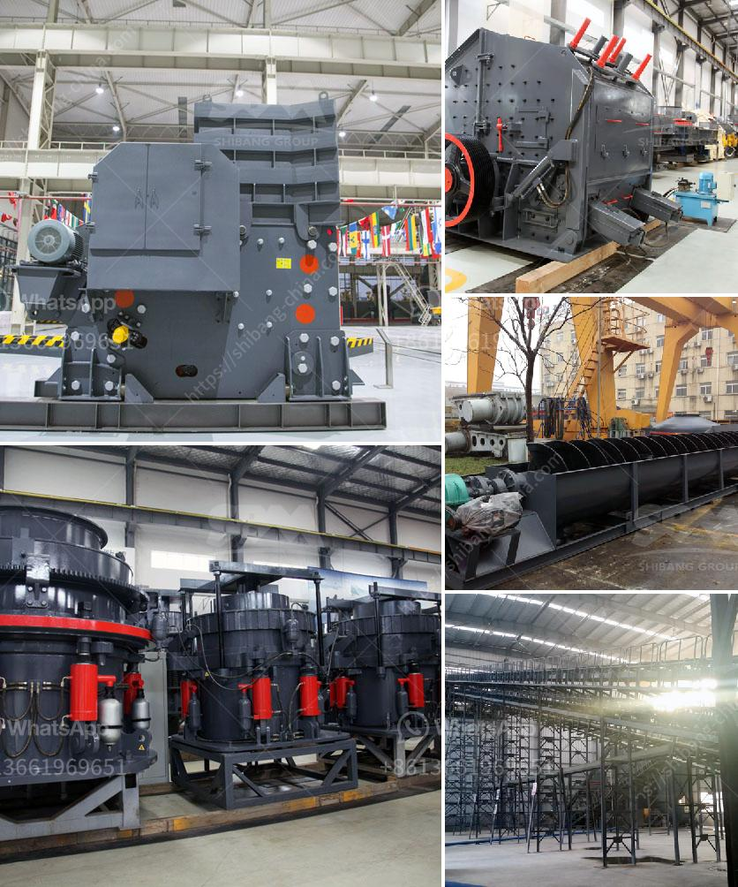

<h3>slag peralatan pabrik vertikal</h3>
Slag, also known as slag cement or ground granulated blast-furnace slag (GGBFS), is a byproduct of the steel manufacturing process. It is produced when iron ore is smelted in a blast furnace and then rapidly cooled, resulting in a glassy granular material. This slag is then ground into a fine powder, which is commonly used as a supplementary cementitious material in the production of concrete.

Pabrik vertikal, or vertical mills, refer to the specialized mills that are used in the grinding and processing of slag. These mills are known for their efficiency and ability to grind the slag into a fine powder, making it suitable for use in concrete production. Vertical mills have a vertically oriented grinding wheel that moves in a circular motion, grinding the slag against the inner wall of the mill. The resulting powder is collected in a dust collector and stored for future use.

One of the main advantages of using slag in concrete production is its high strength and durability. The chemical and physical properties of slag make it an ideal material for enhancing the performance of concrete. Slag reacts with the calcium hydroxide present in cement to form additional cementitious compounds, resulting in improved strength and durability. The use of slag in concrete can therefore lead to longer-lasting structures that require less frequent maintenance and repair.

In addition to its strength-enhancing properties, slag also offers several other benefits. Firstly, it is a more sustainable alternative to traditional cement. By using slag as a supplementary material, the amount of cement required in concrete production can be reduced, leading to a lower carbon footprint and reduced energy consumption. Slag is also a waste material that would otherwise be sent to landfills, so its use in concrete production helps to reduce waste and promote environmental sustainability.

Another advantage of using slag in concrete is its ability to improve workability. Slag particles are smaller and more round in shape compared to cement particles, which can help to fill in the gaps between the larger aggregates in concrete. This results in a smoother and more workable concrete mix, making it easier to place and finish.

Moreover, the use of slag in concrete can also enhance its resistance to chemical attack. Slag particles have a dense structure that reduces the permeability of concrete, making it less susceptible to the ingress of aggressive chemicals such as chlorides and sulfates. This can significantly increase the lifespan of concrete structures exposed to harsh environments such as coastal areas or chemical plants.

Overall, slag peralatan pabrik vertikal plays a crucial role in the production of high-quality and sustainable concrete. Its strength-enhancing, workability-improving, and chemical resistance properties make it a valuable addition to concrete mixes. With the growing emphasis on environmental sustainability and durability, the use of slag in concrete production is expected to become even more widespread in the future.
<h3>Contact us</h3><ul><li><strong>Whatsapp:&nbsp;<a href="https://wa.me/8613661969651">+8613661969651</a></strong></li><li><a href="https://swt.shibang-china.com/?git&amp;zhl&amp;slag peralatan pabrik vertikal"><strong>Online Service(chat now)</strong></a></li></ul><h3>Related</h3><ul><li><a href='chilli powder making machine india price.md'>chilli powder making machine india price</a></li><li><a href='second hand mobile coal washing plant.md'>second hand mobile coal washing plant</a></li><li><a href='roller mill for powders.md'>roller mill for powders</a></li><li><a href='trapizium mill for purvelising.md'>trapizium mill for purvelising</a></li><li><a href='overland conveyor cost calculator.md'>overland conveyor cost calculator</a></li></ul>