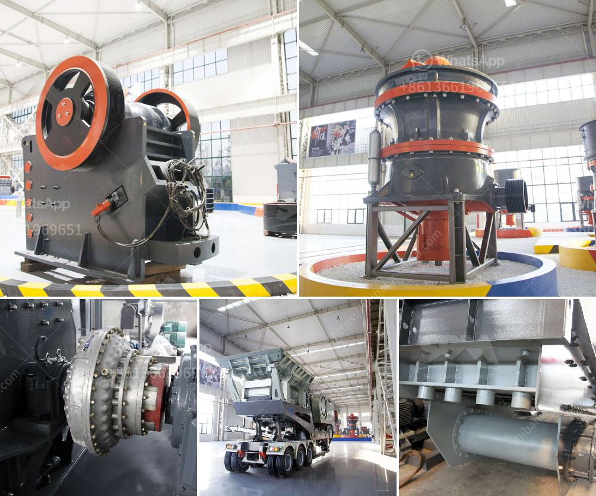

<h3>slag roller mill</h3>
Industrial waste management has always been a significant concern due to its detrimental impact on the environment. One of the most common industrial byproducts that contribute to this issue is slag, a non-metallic residue generated during the production of metals. Traditional disposal methods for slag, such as landfilling and dumping in bodies of water, not only harm the ecosystem but also consume valuable land resources. Fortunately, the advent of slag roller mills has provided a revolutionary solution to tackle this problem effectively.

Slag roller mills are advanced and innovative technologies designed to process slag into fine powders, which can then be reused in various industrial applications. Unlike traditional methods that merely dispose of slag, these mills have paved the way for sustainable and eco-friendly practices, reducing waste and minimizing environmental impact.

One of the core functionalities of slag roller mills is their ability to dry the slag during the grinding process. By utilizing high-temperature air, the mills remove moisture from the slag, enhancing its properties and making it suitable for a wide range of applications. This drying capability prevents slag from becoming a source of pollution and reduces the overall volume of waste generated.

The grinding mechanism of the slag roller mill is another significant aspect that sets it apart from conventional mills. Equipped with multiple grinding rollers, these mills can pulverize slag into finer particles with greater efficiency. The grinding process crushes the slag particles, increasing their surface area and improving their reactivity. This enhanced reactivity makes slag an excellent substitute for cement, as it can enhance the strength, durability, and workability of concrete structures.

Moreover, slag roller mills offer flexibility in terms of output capacity. These mills can be customized based on the specific requirements of the industry, allowing the production of various slag grades. With adjustable parameters such as grinding pressure and airflow, operators can optimize the mill's performance to generate slag powders that meet industry standards.

Furthermore, the utilization of slag roller mills promotes resource conservation. By transforming slag into value-added products, manufacturers can reduce their reliance on natural resources and extractive industries. This circular economy approach ensures a sustainable supply chain where waste is transformed into a valuable resource, fostering a more environmentally conscious and cost-effective industrial landscape.

In conclusion, slag roller mills have revolutionized the management of industrial waste. By employing innovative technologies such as drying and grinding, these mills transform slag into fine powders that can be reused in various industrial applications. This not only mitigates the environmental impact of slag disposal but also reduces the need for natural resource extraction. Slag roller mills represent a significant step towards achieving a more sustainable and eco-friendly future, promoting responsible waste management practices.
<h3>Contact us</h3><ul><li><strong>Whatsapp:&nbsp;<a href="https://wa.me/8613661969651">+8613661969651</a></strong></li><li><a href="https://swt.shibang-china.com/?git&amp;zhl&amp;slag roller mill"><strong>Online Service(chat now)</strong></a></li></ul><h3>Related</h3><ul><li><a href='cement manufacturing plant.md'>cement manufacturing plant</a></li><li><a href='barite crusher machine.md'>barite crusher machine</a></li><li><a href='grinding media balls suppliers in south africa.md'>grinding media balls suppliers in south africa</a></li><li><a href='stone crushing machine cost.md'>stone crushing machine cost</a></li><li><a href='grinding mill machine in ethiopia.md'>grinding mill machine in ethiopia</a></li></ul>