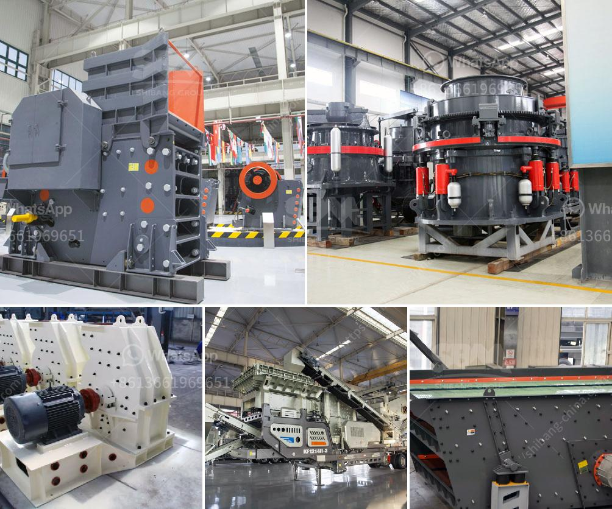

<h3>small ball mill prices in kenya</h3>
Kenya is one of the countries with a sound economic foundation in sub-Saharan Africa and the most developed country in East Africa. In recent years, Kenya's infrastructure construction has developed rapidly. Ball mill is widely used in mining, smelting, road building material and chemical industry. It is the key equipment for grinding after the crush process.The mill consists of feeding device, driving assembly, rotating assembly, bearing unit,discharging assembly and foundation unit.There are two discharging type: wet grid ball mill and dry grid ball mill.

In Kenya, small ball mill refers to the mini ball mill used in small scale cement plants or individual grinding units. The small ball mill is a small-capacity grinding equipment, which is defined relative to large ball mill. It is generally suitable for small-scale production in the trial production stage. Due to its small size and easy movement, small ball mill is sometimes referred to as mobile ball mill. During the production process, it is more flexible and convenient to move.

When it comes to the price of small ball mill in Kenya, it varies a lot. Depending on different specifications, models and sizes of ball mills, the price range is quite wide. Kenya's small ball mill prices are influenced by many factors, such as manufacturer factors, production costs, power consumption, transportation costs, taxation and exchange rate. In addition, the demand and supply of different regions, different seasons and different market conditions will also affect the price.

In general, the small ball mill price in Kenya is relatively low, because the production cost of small ball mill is lower than the large-scale ball mill. The factors affecting the price of ball mill mainly include the following aspects: the quality of the equipment, the price of raw materials, production costs, energy consumption and exchange rate changes. Therefore, when purchasing a small ball mill, customers should consider comprehensively and choose the one that suits their needs and budget.

In conclusion, the price of small ball mill in Kenya is influenced by various factors, and customers should make a reasonable choice based on their own needs and budget. The small ball mill plays an irreplaceable role in small-scale production, and with the development of Kenya's economy, more and more investors are investing in this industry. Therefore, the prospect of small ball mill in Kenya is bright and promising.
<h3>Contact us</h3><ul><li><strong>Whatsapp:&nbsp;<a href="https://wa.me/8613661969651">+8613661969651</a></strong></li><li><a href="https://swt.shibang-china.com/?git&amp;zhl&amp;small ball mill prices in kenya"><strong>Online Service(chat now)</strong></a></li></ul><h3>Related</h3><ul><li><a href='slag crushing plant.md'>slag crushing plant</a></li><li><a href='equipment costs for cement plant.md'>equipment costs for cement plant</a></li><li><a href='ball mill grinding in malaysia.md'>ball mill grinding in malaysia</a></li><li><a href='how much does a quarry machine cost.md'>how much does a quarry machine cost</a></li><li><a href='cost to produce crushed stone per ton at a quarry.md'>cost to produce crushed stone per ton at a quarry</a></li></ul>