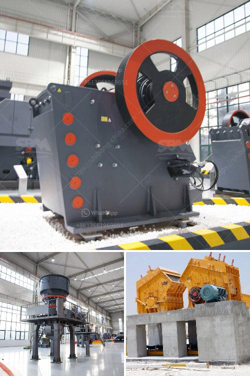

<h3>small ballast making machine for sale kenya</h3>
Are you in the construction industry in Kenya and looking for a reliable and efficient solution for making ballast? Look no further, as a small ballast making machine is now available for sale in Kenya. This machine is ideal for small-scale construction projects and is specifically designed to produce high-quality ballast with ease.

Ballast is an essential material in the construction of roads, railways, and buildings. It serves as a foundation for the structures and helps to maintain the stability and durability of the construction. Traditionally, ballast was manually produced by crushing stones, which was a time-consuming and labor-intensive process. However, with technological advancements, small ballast making machines have been introduced to streamline the production process.

One of the key advantages of the small ballast making machine for sale in Kenya is its compact size. This machine takes up minimal space, making it easy to store and transport. Additionally, it runs on electricity, making it highly convenient to operate in any location, even where there is no access to a power grid. This flexibility makes it an excellent choice for construction sites in remote areas.

Furthermore, the small ballast making machine is highly efficient, producing ballast of consistent quality. It has a powerful motor that efficiently crushes stones into the desired size. The machine is also designed to sieve the crushed stones, ensuring that only stones of the appropriate size are used for making the ballast. This eliminates the need to manually sort the stones, saving valuable time and effort.

The small ballast making machine is also easy to operate, even for those with limited technical knowledge. It comes with a user-friendly interface and clear instructions, allowing anyone to operate the machine with ease. Moreover, it requires minimal maintenance, reducing downtime and enhancing productivity.

Another notable feature of this machine is its affordability. The small ballast making machine is reasonably priced, making it accessible to small-scale construction businesses and individuals. By investing in this machine, construction professionals can produce their own ballast, eliminating the need to rely on external suppliers. This not only saves money but also ensures a steady supply of high-quality ballast when needed.

In conclusion, the availability of a small ballast making machine for sale in Kenya is a game-changer for the construction industry. This machine offers a reliable, efficient, and cost-effective solution for producing high-quality ballast. Its compact size, ease of operation, and affordability make it an ideal choice for small-scale construction projects. By investing in this machine, construction professionals can take control of their ballast production, ensuring a steady supply and saving valuable time and resources. So, if you're in the construction industry in Kenya and looking for an efficient ballast making solution, consider investing in a small ballast making machine.
<h3>Contact us</h3><ul><li><strong>Whatsapp:&nbsp;<a href="https://wa.me/8613661969651">+8613661969651</a></strong></li><li><a href="https://swt.shibang-china.com/?git&amp;zhl&amp;small ballast making machine for sale kenya"><strong>Online Service(chat now)</strong></a></li></ul><h3>Related</h3><ul><li><a href='limestone powder conveying system.md'>limestone powder conveying system</a></li><li><a href='grinding machine parts and their functions.md'>grinding machine parts and their functions</a></li><li><a href='feldspar crusher equipment.md'>feldspar crusher equipment</a></li><li><a href='silica sand washing machine.md'>silica sand washing machine</a></li><li><a href='all about ball mills.md'>all about ball mills</a></li></ul>