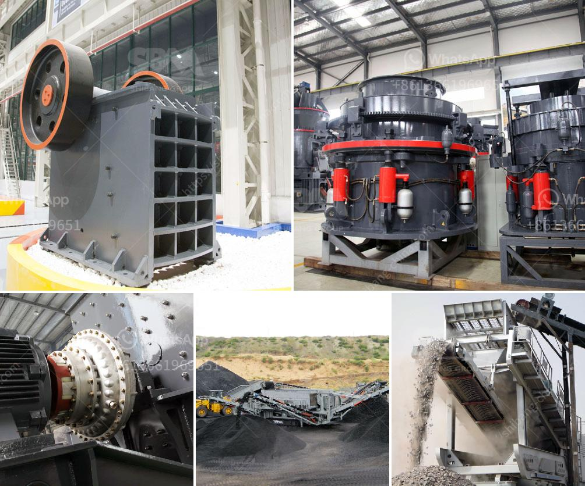

<h3>small feldspar grinding milling plant in nigeria</h3>
Nigeria is rich in feldspar deposits and feldspar grinding is a necessary step when processing feldspar. Feldspar grinding can be a complete process, including crushing, grinding, and screening. In the grinding process, it is important to choose the right equipment to ensure efficient grinding.

The small feldspar grinding milling plant in Nigeria has the capacity of 40-60tph. It will grind the feldspar into powder with the size range of 30-425mesh. The final products can be used in the industry of glass, rubber, plastic, pottery, ceramics, paint, cement, and refractory materials, etc.

In feldspar processing plant, crushing is the first step. In this crushing process, jaw crusher, impact crusher and cone crusher is the common crushing machine. Then feldspar particle enter into the grinding process. In this process, feldspar is grinded into powder, and is classified into various size fractions. The final product is conveyed to the processing plant where it is used for making ground ceramic or filler grade feldspar.

One customer in Nigeria bought one set of feldspar grinding mill line for his project. The main equipment including jaw crusher, impact crusher, hammer crusher, vibrating screen, and other supporting equipment will come out of the warehouse. They are all loaded into a container and will be shipped to Nigeria in April.

This small feldspar grinding milling plant in Nigeria is eager to promote mining technology, and utilize local raw materials to bring economic benefits to the country. In recent years, with Nigeria government's attention to the mining industry, the demand for feldspar grinding milling plant in Nigeria is growing. Investing in feldspar grinding milling plant will bring great profits for local contractors.

In conclusion, it is suitable for small feldspar grinding milling plant in Nigeria. With the advantages of high grinding efficiency, easy operation, low maintenance costs, and low noise, it is an ideal choice for small businesses to invest in.
<h3>Contact us</h3><ul><li><strong>Whatsapp:&nbsp;<a href="https://wa.me/8613661969651">+8613661969651</a></strong></li><li><a href="https://swt.shibang-china.com/?git&amp;zhl&amp;small feldspar grinding milling plant in nigeria"><strong>Online Service(chat now)</strong></a></li></ul><h3>Related</h3><ul><li><a href='crushing plant price list.md'>crushing plant price list</a></li><li><a href='vertical mill coal.md'>vertical mill coal</a></li><li><a href='quartz crusher machinery.md'>quartz crusher machinery</a></li><li><a href='drums of conveyor belts malaysia.md'>drums of conveyor belts malaysia</a></li><li><a href='how much is mobile crusher rock.md'>how much is mobile crusher rock</a></li></ul>