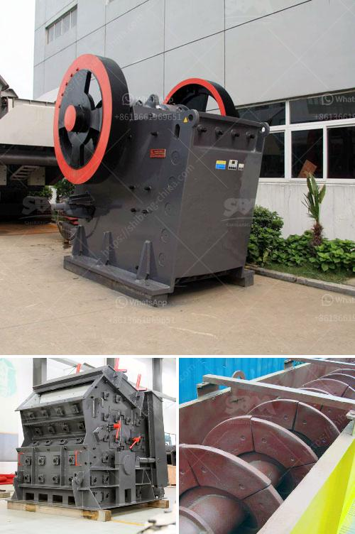

<h3>small gold processing plants for tanzania</h3>
Tanzania, located in Eastern Africa, is known for its vast mineral resources, including gold. The mining industry plays a significant role in the country's economy, contributing to employment opportunities and foreign exchange earnings. However, the majority of gold extraction activities in Tanzania are carried out by large-scale mining corporations, leaving limited opportunities for small-scale miners. This article sheds light on the significance of small gold processing plants in Tanzania, emphasizing their ability to boost local economies and empower local communities.

Small-scale mining is an important and vibrant sector in Tanzania's mining industry. It provides employment to a large number of people, especially in rural areas, where alternative sources of income are limited. Small-scale miners, often referred to as artisanal miners, typically lack access to advanced equipment and technology, resulting in lower productivity compared to large-scale operations. Therefore, the establishment of small gold processing plants becomes crucial to bridge this technological gap and enable local miners to optimize their yield.

Small gold processing plants in Tanzania facilitate local value addition by enabling the extraction of precious metals within the country itself. Previously, small-scale miners had limited options to process their ores, forcing them to sell raw materials to foreign buyers at a significantly lower price. With the presence of small gold processing plants, miners can now process their ore on-site, extracting and refining gold to generate higher-quality products, thus maximizing their profits.

The establishment of small gold processing plants in Tanzania has the potential to greatly benefit local communities surrounding mining areas. By creating local job opportunities, these plants can aid in poverty reduction, improving the standard of living for residents. Small-scale miners, with their newfound ability to process and refine gold, can significantly contribute to the local economy's growth. This economic boost can further lead to increased investments in infrastructure, education, and healthcare, thereby enhancing the quality of life in these communities.

Introducing small gold processing plants also has positive implications for environmental sustainability. Traditional artisanal mining methods often involve the use of toxic chemicals, such as mercury, posing serious health risks and causing environmental damage. By promoting the adoption of modern and environmentally friendly technologies within these processing plants, harmful practices can be minimized, reducing pollution levels and preserving the surrounding ecosystems.

To harness the full potential of small gold processing plants, the Tanzanian government should provide regulatory support and incentives. Streamlining the legal and licensing framework for small-scale miners can encourage their participation and foster a conducive business environment. Collaborating with international organizations and stakeholders to provide training, financing options, and technical assistance will also be vital in promoting the growth and sustainability of these plants.

Small gold processing plants have immense potential in transforming Tanzania's mining industry. By empowering small-scale miners, promoting job creation, and enabling local value addition, these plants can significantly contribute to poverty reduction and economic development in mining communities. Furthermore, their adoption can promote environmental sustainability through the use of modern and cleaner technologies. With adequate government support and regulation, small gold processing plants have the power to enhance Tanzania's local economies for years to come.
<h3>Contact us</h3><ul><li><strong>Whatsapp:&nbsp;<a href="https://wa.me/8613661969651">+8613661969651</a></strong></li><li><a href="https://swt.shibang-china.com/?git&amp;zhl&amp;small gold processing plants for tanzania"><strong>Online Service(chat now)</strong></a></li></ul><h3>Related</h3><ul><li><a href='grinding machine manufacturers from europe.md'>grinding machine manufacturers from europe</a></li><li><a href='bentonite clay processing plant.md'>bentonite clay processing plant</a></li><li><a href='gypsum board making machine price in pakistan.md'>gypsum board making machine price in pakistan</a></li><li><a href='conveyor belt structure design.md'>conveyor belt structure design</a></li><li><a href='vertical mill coal.md'>vertical mill coal</a></li></ul>