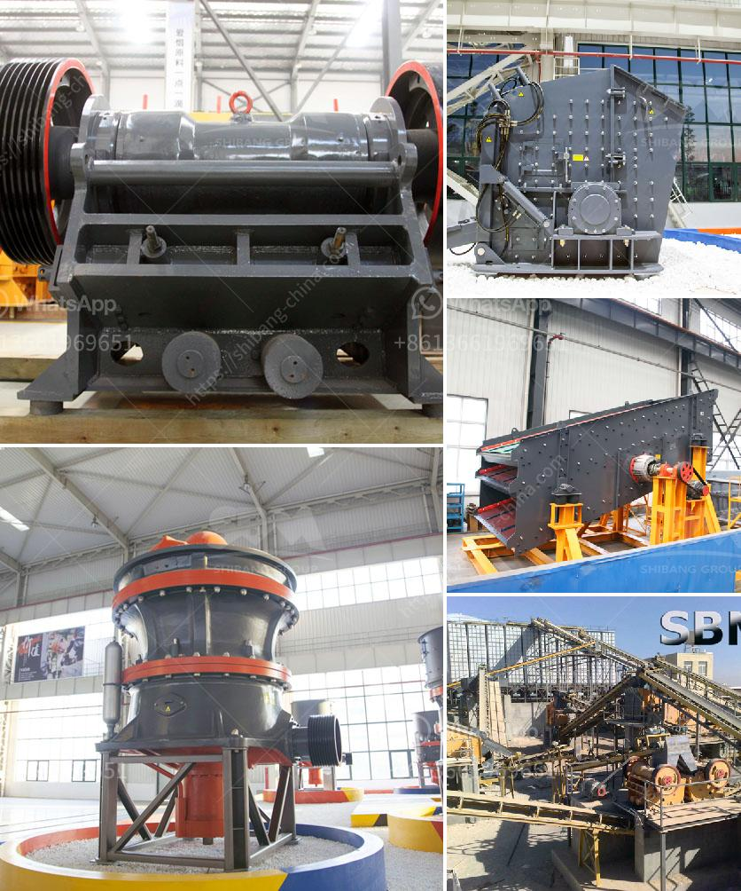

<h3>small jaw crusher for sale</h3>
Small jaw crusher is a stone crusher or rock crusher with low energy consumption, easy installation, and maintenance etc. According to the feeding width, jaw crusher can be divided into large, medium and small sized. The jaw crushers with compressive strength under 320Mpa of medium and large size designed and manufactured by our company have reached the advanced level.

Small jaw crusher is a necessary crushing machine in the construction and mining industries. It is mainly used to crush large stones into small pieces and is generally used in secondary crushing operations. The jaw crusher adopts the extrusion process between the moving jaw plate and the static jaw plate. Application: It is widely used in mining, smelting, building materials, highway, railway, water conservancy and chemical industries, and is often used for coarse crushing and fine crushing of various ores and rocks.

The working principles of a small jaw crusher is as follows: the motor drives the belt and the pulley to move the movable jaw up and down through the eccentric shaft. When the movable jaw rises, the angle between the toggle plate and the movable jaw becomes larger, which pushes the movable jaw plate to approach the fixed jaw plate. When the movable jaw plate moves away from the fixed jaw plate, the broken material is discharged from the lower part of the crushing chamber.

One of the best-selling small jaw crushers in the international market is PE series small jaw crusher, which is from FTM Crusher Company. With the continuous advancement of technology and increase in production capacity, the price of jaw crusher keeps moving up. The small jaw crusher has high production efficiency, uniform particle size, low energy consumption, and easy maintenance. It is used in the crushing of various ores and bulk materials in industries such as mining, building materials, highways, railways, water conservancy, and chemical industry. According to the width of the inlet, it is divided into three types: large, medium and small.

1. Large crushing ratio: uniform particle size, simple structure, reliable operation, easy maintenance and low operating costs.

2. The lubrication system is safe and reliable, the parts are easy to replace, and the maintenance workload is small.

3. The movable jaw assembly is made of high-quality cast steel alloy, and the heavy-duty eccentric shaft is processed by forging blanks, which makes the machine more reliable and durable.

4. The bearing chamber adopts a parallel structure to facilitate the accurate positioning of the bearing.

5. The adjustment device of the discharge port is convenient and reliable, which can meet the needs of different customers.

In summary, small jaw crusher is suitable for crushing various stones and rocks with compressive strength less than 320 MPa. It has the advantages of large crushing ratio, convenient maintenance, uniform particle size, and high production efficiency. It can be used in both primary and secondary crushing operations, making it an ideal choice for mining, smelting, building materials, highways, railways, water conservancy, and chemical industries. With the increasing demand for small jaw crushers in the market, FTM Crusher Company has made great efforts to continuously improve product performance and provide customers with more economical and practical crushing equipment.
<h3>Contact us</h3><ul><li><strong>Whatsapp:&nbsp;<a href="https://wa.me/8613661969651">+8613661969651</a></strong></li><li><a href="https://swt.shibang-china.com/?git&amp;zhl&amp;small jaw crusher for sale"><strong>Online Service(chat now)</strong></a></li></ul><h3>Related</h3><ul><li><a href='crusher stone peru.md'>crusher stone peru</a></li><li><a href='application of hammer mill.md'>application of hammer mill</a></li><li><a href='balls for ball mill in india.md'>balls for ball mill in india</a></li><li><a href='jaw crusher for sale uk.md'>jaw crusher for sale uk</a></li><li><a href='calcium carbonate pulverizer suppliers.md'>calcium carbonate pulverizer suppliers</a></li></ul>