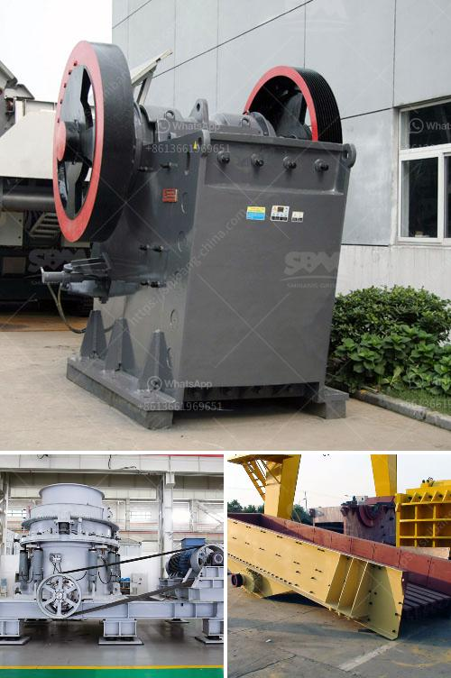

<h3>small mobile crushers</h3>
As the construction industry continues to evolve and embrace new technologies, small mobile crushers are becoming an increasingly popular choice for projects of all sizes. These compact yet powerful machines are versatile enough to handle a wide range of materials and can be easily transported to different job sites. In this article, we will explore the benefits of small mobile crushers and how they are revolutionizing the construction industry.

One of the key advantages of small mobile crushers is their portability. These machines can be easily transported from one location to another, making them ideal for contractors who need to move frequently between job sites. Instead of relying on larger, stationary crushers, which often require extensive setup and dismantling, small mobile crushers offer a plug-and-play solution. They can be up and running within minutes, providing operators with maximum flexibility and minimizing downtime.

Despite their smaller size, these crushers pack a powerful punch. They are designed to crush a wide range of materials, including concrete, asphalt, and rock, transforming them into usable aggregates for construction projects. The processing capacity of small mobile crushers typically ranges from 50 to 400 tons per hour. This allows contractors to achieve high productivity levels while minimizing material costs.

Another significant advantage of small mobile crushers is their environmental benefits. These machines are designed to operate with reduced noise and emissions, making them an eco-friendly choice. This is especially crucial for construction projects in urban areas where noise and air pollution can be a concern. By choosing small mobile crushers, contractors can comply with environmental regulations and contribute to a more sustainable industry.

In addition to their portability and environmental benefits, small mobile crushers offer time and cost savings. With these machines, contractors can crush, process, and reuse waste materials on-site, eliminating the need for costly transportation, landfill fees, and the purchase of new aggregates. This not only saves money but also reduces the reliance on natural resources, promoting a more circular economy.

Furthermore, the versatility of small mobile crushers allows them to be used in various applications. Whether it be crushing concrete for foundations or recycling asphalt for road construction, these machines can adapt to the specific needs of each project. Their compact size also makes them ideal for projects with limited space, such as urban renovations or indoor demolitions.

The use of small mobile crushers is transforming the construction industry by providing contractors with efficient and sustainable solutions. These machines offer portability, high productivity, and reduced environmental impact, all crucial factors for today's construction projects. As the industry continues to evolve, small mobile crushers are expected to play an increasingly significant role in improving efficiency and reducing costs. By embracing these innovative machines, contractors can stay ahead of the curve and contribute to a more sustainable future.
<h3>Contact us</h3><ul><li><strong>Whatsapp:&nbsp;<a href="https://wa.me/8613661969651">+8613661969651</a></strong></li><li><a href="https://swt.shibang-china.com/?git&amp;zhl&amp;small mobile crushers"><strong>Online Service(chat now)</strong></a></li></ul><h3>Related</h3><ul><li><a href='mobile crusher south africa.md'>mobile crusher south africa</a></li><li><a href='fly ash processing plant for sale.md'>fly ash processing plant for sale</a></li><li><a href='crusher sand and stone in kenya.md'>crusher sand and stone in kenya</a></li><li><a href='kenya quartz crushing.md'>kenya quartz crushing</a></li><li><a href='crusher near sale saudi arabia.md'>crusher near sale saudi arabia</a></li></ul>