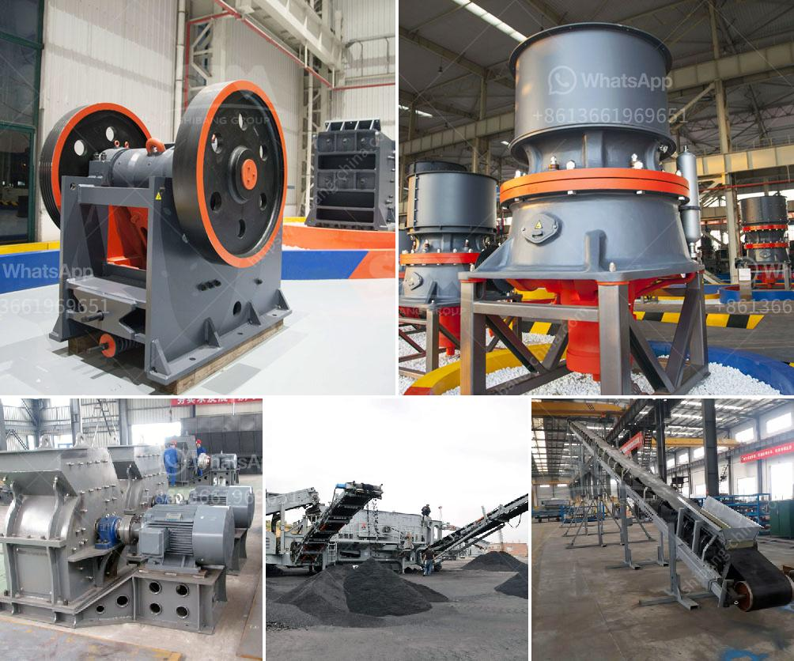

<h3>small portable rock crushers</h3>
In the ever-changing world of construction and mining, there is always a need for efficient and reliable machinery. This is especially true when it comes to rock crushers. Whether you are working on a residential project or in a busy mining site, having a portable rock crusher is a valuable asset. With its lightweight design and compact structure, it can easily be transported to different locations without much hassle.

One of the key advantages of small portable rock crushers is their ability to be assembled and disassembled quickly. This makes them easy to transport and ideal for temporary projects. Whether you need to crush rocks on a construction site or need to process minerals in a remote location, these crushers provide a convenient solution. They can be moved from one place to another with minimal effort and set up in no time.

Despite their small size, these portable rock crushers pack a punch when it comes to crushing power. Equipped with strong jaws, they can effectively break down various materials including concrete, asphalt, and natural rocks. Their versatility allows for diverse applications, whether it is crushing materials for road construction, recycling debris, or extracting valuable resources.

Moreover, small portable rock crushers are designed with safety in mind. They are equipped with features such as a safety switch to prevent accidental starting, as well as guards and shields to protect operators from flying debris. Additionally, they produce less noise and vibration, making them more environmentally friendly.

In conclusion, small portable rock crushers offer convenience, efficiency, and versatility. You can count on them to tackle various crushing tasks with ease. Their portability allows for easy transportation, while their powerful crushing capabilities make them suitable for a wide range of applications. So, if you are in need of a reliable rock crusher, consider investing in a small portable one. It will be a valuable addition to your construction or mining fleet, making your projects more efficient and productive.
<h3>Contact us</h3><ul><li><strong>Whatsapp:&nbsp;<a href="https://wa.me/8613661969651">+8613661969651</a></strong></li><li><a href="https://swt.shibang-china.com/?git&amp;zhl&amp;small portable rock crushers"><strong>Online Service(chat now)</strong></a></li></ul><h3>Related</h3><ul><li><a href='manufacturer of quartz powder mill.md'>manufacturer of quartz powder mill</a></li><li><a href='crusher sale philippines.md'>crusher sale philippines</a></li><li><a href='price and 900 stone crusher.md'>price and 900 stone crusher</a></li><li><a href='stone crasher busness plan pdf.md'>stone crasher busness plan pdf</a></li><li><a href='business plan for marble and granite factory pdf.md'>business plan for marble and granite factory pdf</a></li></ul>