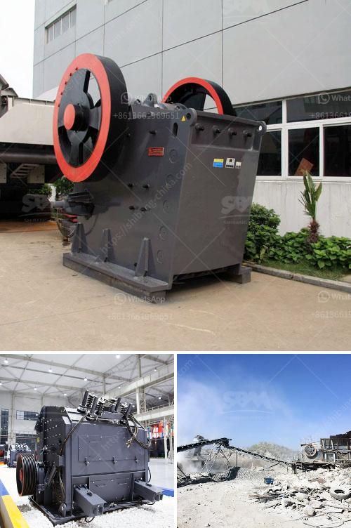

<h3>small rock crusher australia</h3>
Are you an avid prospector looking for a durable and affordable rock crusher to add to your equipment? Look no further than the small rock crusher Australia. These machines are perfect for the weekend prospector as they can crush rocks of all sizes and types, making it easier to recover gold and other valuable minerals.

One of the key features of these small rock crushers is their portability. They are compact, lightweight, and can easily be transported from one location to another, making them suitable for on-site crushing. Whether you are exploring remote areas or working on a small-scale mining project, these crushers can be your trustworthy companion.

Small rock crushers are designed to handle various types of rocks, including limestone, granite, and basalt. They are mostly preferred in the primary and secondary crushing stages. The feed materials are processed in a mechanical manner, reducing them to smaller sizes. This allows for efficient extraction of valuable minerals and simplifies the process of concentrating and smelting.

The affordability factor of these small rock crushers is another reason why they are popular among prospectors. Compared to larger crushers, they are reasonably priced and offer great value for money. Additionally, their maintenance cost is relatively low, allowing prospectors to allocate their resources towards other operational requirements.

Small rock crushers in Australia come with different types of engines. Whether you prefer gasoline, diesel, or electric-powered crushers, you can find the ideal model to suit your needs. Each type of engine provides its own advantages, so choose the one that meets your specific requirements and preferences.

If you are a weekend prospector or a small-scale miner, investing in a small rock crusher Australia is a must. These machines are versatile, portable, and affordable, making them an excellent addition to your prospecting equipment. With their help, you can crush rocks on-site and recover valuable minerals with ease. So, gear up and get ready to take your prospecting adventures to the next level!
<h3>Contact us</h3><ul><li><strong>Whatsapp:&nbsp;<a href="https://wa.me/8613661969651">+8613661969651</a></strong></li><li><a href="https://swt.shibang-china.com/?git&amp;zhl&amp;small rock crusher australia"><strong>Online Service(chat now)</strong></a></li></ul><h3>Related</h3><ul><li><a href='mobile vibrating screen for iron.md'>mobile vibrating screen for iron</a></li><li><a href='brick factory for sale in uk.md'>brick factory for sale in uk</a></li><li><a href='objectives of ball mill.md'>objectives of ball mill</a></li><li><a href='used cone crusher for sale ton per hour.md'>used cone crusher for sale ton per hour</a></li><li><a href='philippines stone crusher philippines.md'>philippines stone crusher philippines</a></li></ul>