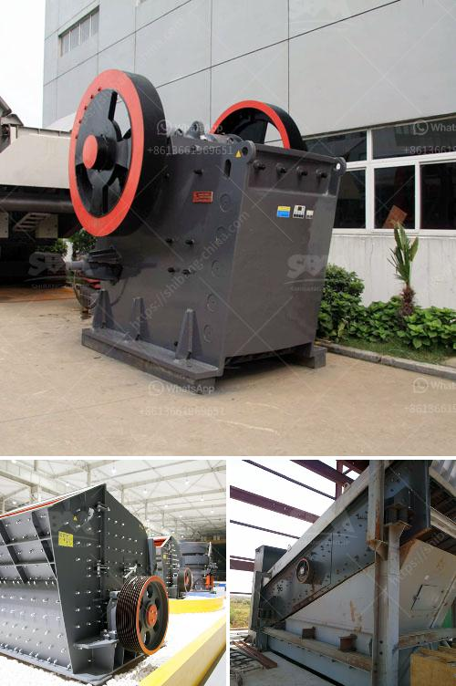

<h3>small rock crusher</h3>
A rock crusher is a machine designed to break large rocks into smaller ones. Small rock crushers have gained popularity over the years due to their cost-effectiveness and efficient performance. With the advancement in technology, you don't need to worry about crushing large volumes of rocks, as you can easily obtain a small rock crusher. In this article, we will discuss the benefits and applications of a small rock crusher.

One of the primary benefits of a small rock crusher is its versatility. You can use it for various applications, such as crushing rocks, recycling concrete, and asphalt, and even for agricultural purposes. For example, if you have a construction project, a small rock crusher can help you crush the rocks into specific sizes required for your project.

Moreover, small rock crushers are also useful for homeowners and DIY enthusiasts. If you have a garden or a backyard, you can use a small rock crusher to crush stones and create pathways or patio areas. It can also be used as a decorative element, giving your garden a unique and artistic touch.

Another advantage of using a small rock crusher is its ease of use. Most small rock crushers are portable and can be easily transported to different job sites. This allows you to save time and money by avoiding the need for large machinery. Additionally, many small rock crushers are equipped with wheels, making it even more convenient to move them around.

When it comes to performance, small rock crushers are known for their efficiency. Despite their compact size, these crushers are capable of producing high-quality crushed materials. They can easily break down rocks into smaller, more manageable pieces, making it easier for further processing.

Furthermore, small rock crushers are typically powered by electricity or diesel engines, which ensures their reliability and low maintenance requirements. These crushers are designed to withstand heavy use and are equipped with robust components that can withstand wear and tear.

In conclusion, a small rock crusher is a valuable tool that can enhance your productivity and simplify your work. Whether you are a contractor, a homeowner, or a DIY enthusiast, a small rock crusher can help you tackle a wide range of projects. Its versatility, portability, and efficiency make it a perfect choice for crushing rocks, recycling materials, and even enhancing the aesthetics of your garden. With the right small rock crusher, you can save time, effort, and money, all while achieving excellent results. So, if you have any upcoming project or landscaping idea, consider investing in a small rock crusher and experience the many benefits it offers.
<h3>Contact us</h3><ul><li><strong>Whatsapp:&nbsp;<a href="https://wa.me/8613661969651">+8613661969651</a></strong></li><li><a href="https://swt.shibang-china.com/?git&amp;zhl&amp;small rock crusher"><strong>Online Service(chat now)</strong></a></li></ul><h3>Related</h3><ul><li><a href='small gold processing plants for tanzania.md'>small gold processing plants for tanzania</a></li><li><a href='granite crusher cost.md'>granite crusher cost</a></li><li><a href='limestone belt conveyor.md'>limestone belt conveyor</a></li><li><a href='mobile vibrating screen for iron.md'>mobile vibrating screen for iron</a></li><li><a href='price and 900 stone crusher.md'>price and 900 stone crusher</a></li></ul>