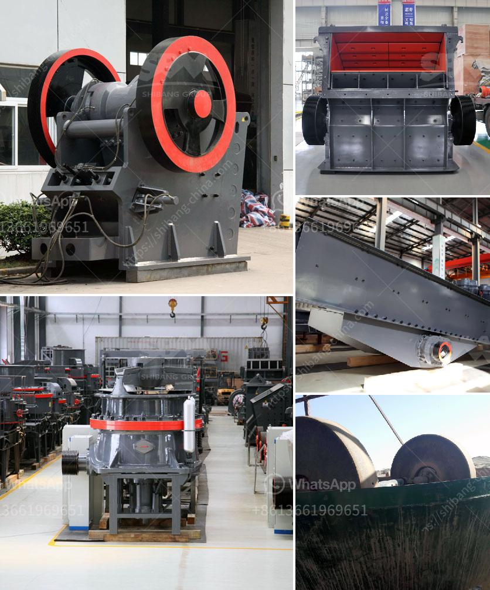

<h3>small scale copper refinery project ideas</h3>
Copper is an essential metal that plays a crucial role in various industries, including electronics, construction, and transportation. With its excellent thermal and electrical conductivity properties, copper is in high demand worldwide. As a result, setting up a small scale copper refinery project can be a profitable venture for aspiring entrepreneurs. In this article, we will explore some unique ideas for small scale copper refinery projects.

One of the most popular and viable options for a small scale copper refinery project is the processing of scrap copper. This involves collecting and recycling copper wires, cables, and other post-consumer copper products. The scrap copper can be melted and refined into pure copper ingots or pellets, which can then be sold to manufacturers or traders.

Electronic waste, commonly known as e-waste, is a significant source of valuable metals, including copper. Setting up a small-scale copper refinery project that specializes in e-waste recycling can be a lucrative opportunity. This involves collecting discarded electronic devices like computers, smartphones, and televisions, and extracting copper through specialized processes. E-waste recycling not only helps in recovering copper but also contributes to reducing environmental pollution.

Instead of focusing solely on refining copper, another small-scale project idea is to establish a copper wire production unit. Copper wire is in high demand for electrical and telecommunications applications. By melting and drawing copper into wires of different gauges, this project can cater to various industries' needs for copper wire.

Copper alloys offer enhanced properties such as increased strength, corrosion resistance, and improved electrical conductivity. Establishing a small scale copper refinery project that specializes in manufacturing copper alloys can be a profitable endeavor. This project involves blending copper with other elements like zinc, nickel, or aluminum to create alloys suitable for specific applications.

Copper tubes find extensive usage in plumbing, HVAC systems, and refrigeration equipment. A small-scale copper refinery project that focuses on the manufacturing of copper tubes can tap into this market. The project requires melting copper and extruding it into tubes of different sizes and thicknesses. These tubes can then be sold to manufacturers or traders in the construction, manufacturing, or engineering sectors.

When setting up a small-scale copper refinery project, it is important to consider various factors like market demand, availability of raw materials, cost of equipment, and required permits and licensing. Conducting a thorough feasibility study and evaluating the project's economic viability is crucial before initiating any investments.

Furthermore, entrepreneurs should ensure that the project adheres to environmental regulations and employs sustainable practices. This can include incorporating proper waste management systems and focusing on energy-efficient processes to minimize the project's carbon footprint.

In conclusion, small-scale copper refinery projects offer numerous opportunities for aspiring entrepreneurs. From recycling scrap copper to manufacturing copper alloys or tubes, there are several unique project ideas to explore. However, it is essential to conduct thorough research and analysis to assess the project's feasibility and profitability before venturing into the copper refinery industry.
<h3>Contact us</h3><ul><li><strong>Whatsapp:&nbsp;<a href="https://wa.me/8613661969651">+8613661969651</a></strong></li><li><a href="https://swt.shibang-china.com/?git&amp;zhl&amp;small scale copper refinery project ideas"><strong>Online Service(chat now)</strong></a></li></ul><h3>Related</h3><ul><li><a href='rock cone crushers.md'>rock cone crushers</a></li><li><a href='mobile crusher seller.md'>mobile crusher seller</a></li><li><a href='mini rock crushers.md'>mini rock crushers</a></li><li><a href='x36 double roller crusher used.md'>x36 double roller crusher used</a></li><li><a href='gold hammer crusher.md'>gold hammer crusher</a></li></ul>