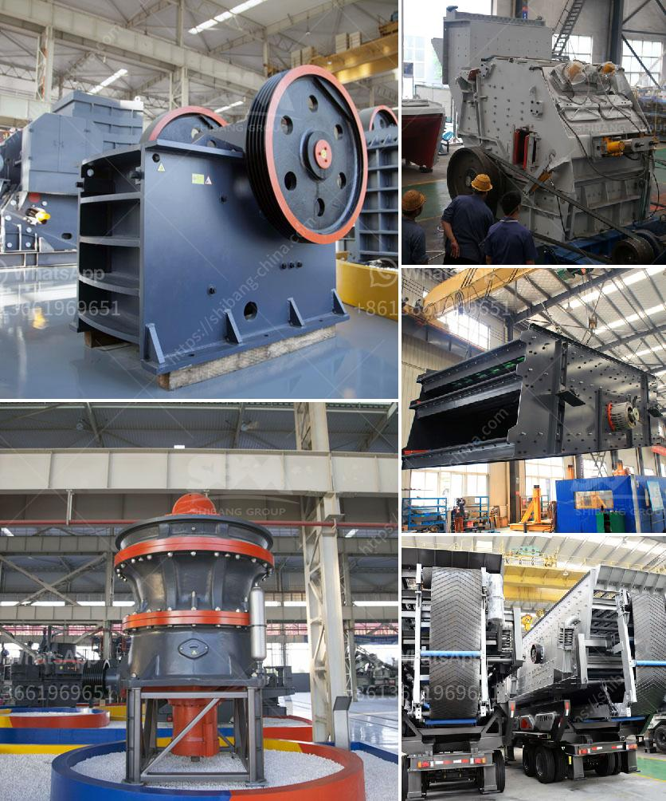

<h3>small scale gold mining professional equipment</h3>
Small scale gold mining has gained popularity over the years due to its low cost and easy process. Though it is an informal and illegal activity in many countries, small scale gold mining has provided livelihoods for communities, creating jobs and boosting local economies.

To ensure the safety and efficiency of small scale gold mining operations, it is essential to have professional equipment. Professional equipment not only helps miners extract gold more efficiently but also reduces the environmental impact of their activities.

One of the most crucial pieces of professional equipment for small scale gold mining is the gold dredge. A gold dredge is a floating platform equipped with a suction system that extracts gold from riverbeds and streams. With the help of a motorized pump, the dredge sucks up gravel and water, separating gold particles from other sediment. This equipment significantly speeds up the gold extraction process and allows miners to cover larger areas.

Another important tool for small scale gold miners is a sluice box. A sluice box is a long and narrow channel with riffles or grooves along the bottom. As water flows through the sluice box, gold particles get trapped in the riffles while the lighter sediment washes away. Sluice boxes are portable and easy to set up, making them ideal for small scale operations.

Additionally, a gold pan is essential for any small scale gold miner. A gold pan is a shallow, wide-bottomed metal or plastic pan used for washing and separating gold from gravel or sand. Miners typically scoop up sediments from rivers or streams into the pan and then swirl it around. The heavy gold particles settle to the bottom while the lighter materials are washed away.

Using professional equipment goes beyond increasing efficiency. It also contributes to environmental sustainability. For example, gold dredges are designed to minimize disruption to aquatic ecosystems by extracting gold without causing excessive harm to the surrounding environment. Proper equipment ensures that small scale gold miners can extract gold responsibly, protecting the environment they rely on.

In conclusion, professional equipment plays a crucial role in small scale gold mining operations. Gold dredges, sluice boxes, and gold pans are commonly used tools that improve efficiency and reduce environmental impact. By investing in professional equipment, small scale gold miners can maintain sustainable practices and support the economic development of their communities.
<h3>Contact us</h3><ul><li><strong>Whatsapp:&nbsp;<a href="https://wa.me/8613661969651">+8613661969651</a></strong></li><li><a href="https://swt.shibang-china.com/?git&amp;zhl&amp;small scale gold mining professional equipment"><strong>Online Service(chat now)</strong></a></li></ul><h3>Related</h3><ul><li><a href='scrap prices per ton in south africa.md'>scrap prices per ton in south africa</a></li><li><a href='silica sand price per tonne.md'>silica sand price per tonne</a></li><li><a href='feldspar crusher equipment.md'>feldspar crusher equipment</a></li><li><a href='grinding mill prices in harare.md'>grinding mill prices in harare</a></li><li><a href='komatsu mobile impact crusher.md'>komatsu mobile impact crusher</a></li></ul>