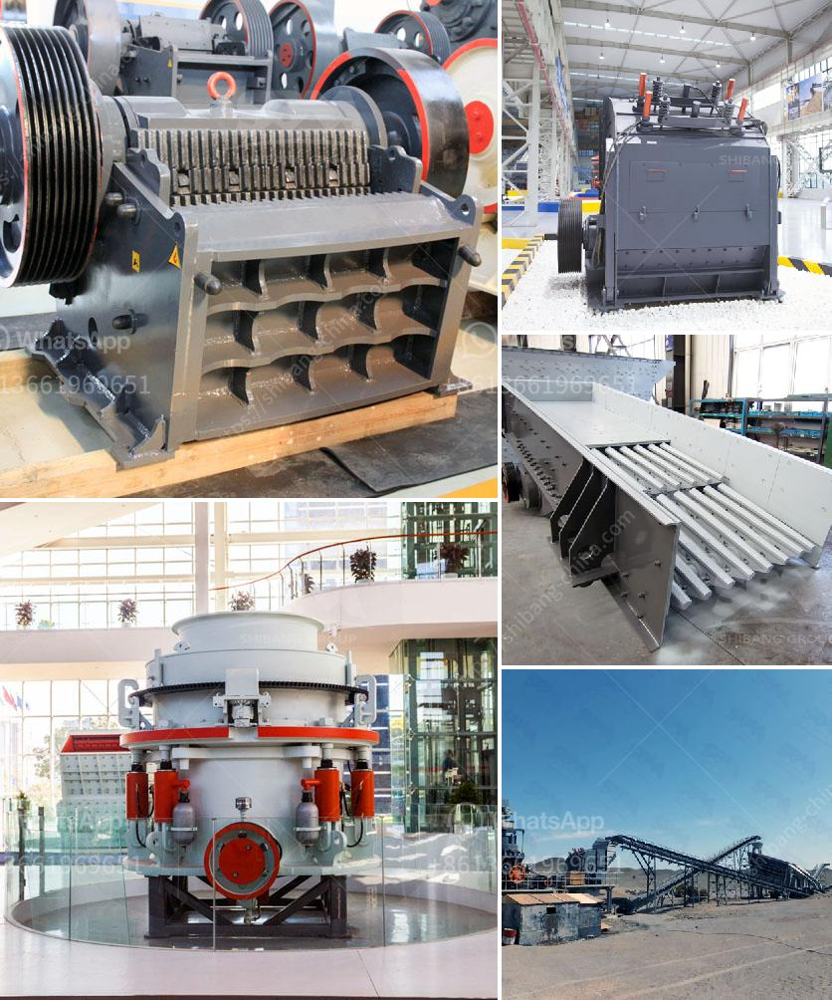

<h3>small scale gold mining using stamp mill</h3>
Small-scale gold mining has been practiced for thousands of years by indigenous tribes in various parts of the world. One of the traditional methods used to extract gold from the ore is called stamp milling. This technique employs heavy metal stamps to crush the ore and free the gold particles. 

The stamp mill consists of a large wooden frame housing multiple iron or steel stamps mounted on a horizontal shaft. The stamps are raised and dropped by a cam mechanism, crushing the ore between them and a hard surface like a mortar or bowl. The resulting crushed material is then washed through a series of sieves to separate the gold particles from the rest of the ore.

Stamp milling is a cost-effective method for small-scale gold miners as the equipment required is relatively simple and inexpensive. It also does not require advanced technical skills, making it accessible to individuals without formal mining training. Furthermore, the stamp mill can process a large amount of ore in a relatively short time compared to other methods, allowing miners to extract gold quickly.

However, there are several challenges associated with stamp milling. The first is the availability and cost of the stamps themselves, as they need to be replaced regularly due to wear and tear. Additionally, the stamp mill requires a constant water supply to wash the crushed material, making it dependent on nearby water sources.

Another concern is the environmental impact of stamp milling. The process produces a significant amount of fine dust, which can contain harmful substances like silica. Miners and nearby communities may be at risk of exposure to these hazardous materials, potentially leading to health issues in the long term.

Efforts are being made to address these challenges and improve the sustainability of stamp milling. Governments and organizations are providing assistance to small-scale miners, including access to safer and more efficient equipment. Additionally, educational programs are being implemented to promote responsible mining practices and environmental stewardship.

In conclusion, small-scale gold mining using stamp mills is an ancient and cost-effective method of extracting gold from the ore. While it has its challenges and environmental concerns, efforts are being made to mitigate these issues and promote sustainable mining practices.
<h3>Contact us</h3><ul><li><strong>Whatsapp:&nbsp;<a href="https://wa.me/8613661969651">+8613661969651</a></strong></li><li><a href="https://swt.shibang-china.com/?git&amp;zhl&amp;small scale gold mining using stamp mill"><strong>Online Service(chat now)</strong></a></li></ul><h3>Related</h3><ul><li><a href='stone crushers in kenya.md'>stone crushers in kenya</a></li><li><a href='gold mining equipment company in japan.md'>gold mining equipment company in japan</a></li><li><a href='stone crusher zenith.md'>stone crusher zenith</a></li><li><a href='gold mining equipment manufacturer china.md'>gold mining equipment manufacturer china</a></li><li><a href='second hand mobile coal washing plant.md'>second hand mobile coal washing plant</a></li></ul>