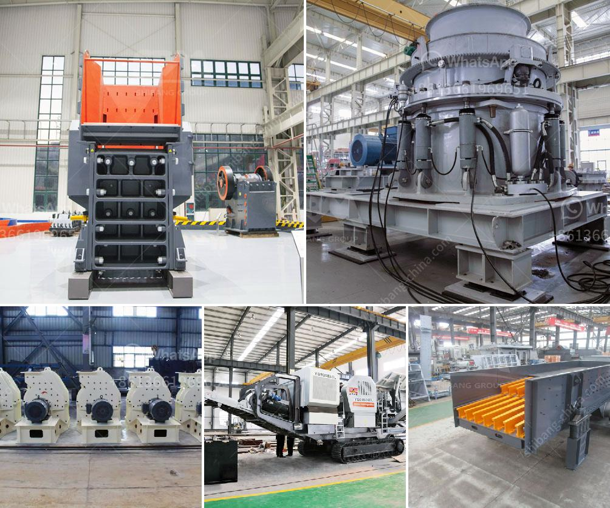

<h3>small scale gold processing line</h3>
Artisanal and small-scale gold miners (ASGM) play a significant role in global gold production, accounting for approximately 20% of the total gold mined each year. These miners often work in remote areas with limited resources, facing numerous challenges to extract gold from ore. However, with the advancement in technology and the introduction of small scale gold processing lines, ASGM can now adopt sustainable and efficient methods to extract gold, benefiting both themselves and the environment.

A small scale gold processing line typically consists of a jaw crusher, a ball mill, a spiral classifier, gold concentrator, and a shaking table. This equipment is specifically designed for the small-scale miners, enabling them to take large chunks of ore and break them down into smaller, more manageable pieces. The jaw crusher crushes the ore into gravel-sized particles, while the ball mill further reduces it to a fine powder.

Once the ore is crushed and ground, the spiral classifier separates the particles based on their size and specific gravity. This process allows for the separation of heavier particles, which contain the gold, from lighter particles. The gold concentrator then further refines the gold-rich particles, increasing the concentration of gold in the final product.

The final step in the small scale gold processing line is the use of a shaking table. This table uses a combination of gravity and water flow to separate the gold from other minerals and impurities. The gold particles will settle on the table's surface due to their higher density, while the lighter materials are washed away. This process ensures that the final product is of high purity and suitable for sale or further refining.

The implementation of small scale gold processing lines has numerous benefits for ASGM. Firstly, it helps reduce the use of mercury, a harmful substance often used by artisanal miners to extract gold. Mercury is highly toxic and poses serious health hazards to both miners and the environment. By adopting these new processing techniques, miners can minimize their reliance on mercury, protecting their own health and reducing environmental pollution.

Furthermore, small scale gold processing lines also improve the recovery rates of gold. Traditional ASGM methods often result in low recovery rates due to inefficient extraction techniques. By using modern equipment and processing methods, miners can maximize their gold recovery, increasing their income and economic stability.

Additionally, small scale gold processing lines streamline the overall mining process, making it more efficient and cost-effective. Miners can produce higher-grade gold concentrates, reducing the volume of ore that needs to be transported and processed. This optimization reduces operational costs and improves the overall profitability of the mining operation.

In conclusion, small scale gold processing lines are revolutionizing the ASGM industry. These innovative technologies allow artisanal and small-scale miners to adopt sustainable and efficient methods, enabling them to extract gold more effectively while minimizing the use of mercury and reducing environmental harm. With further advancements in this field, small scale gold processing lines have the potential to uplift millions of miners and transform the ASGM sector into a more sustainable and responsible industry.
<h3>Contact us</h3><ul><li><strong>Whatsapp:&nbsp;<a href="https://wa.me/8613661969651">+8613661969651</a></strong></li><li><a href="https://swt.shibang-china.com/?git&amp;zhl&amp;small scale gold processing line"><strong>Online Service(chat now)</strong></a></li></ul><h3>Related</h3><ul><li><a href='black stone crushing nigeria.md'>black stone crushing nigeria</a></li><li><a href='impact crusher in lima peru.md'>impact crusher in lima peru</a></li><li><a href='turkey plant production line of gypsum powder.md'>turkey plant production line of gypsum powder</a></li><li><a href='chilli powder making machine india price.md'>chilli powder making machine india price</a></li><li><a href='crushing plant assembly.md'>crushing plant assembly</a></li></ul>