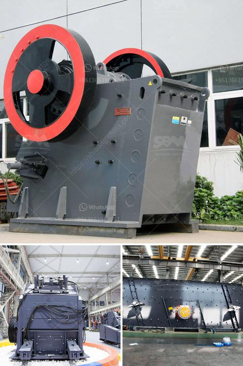

<h3>small scale marble crushing and processing industery</h3>
Small scale marble crushing and processing industery may be a profitable business venture for many entrepreneurs. Small scale industries also play a significant role in the overall development of a country. However, marble mining and processing industries are notorious for their detrimental effects on the environment due to the cutting-edge extraction techniques.

Marble, a metamorphic rock composed primarily of calcite, is widely used in various industries like construction, architecture, and sculpture. Its natural beauty, durability, and availability in various colors and patterns make it a popular choice for many projects. However, the extraction process involves significant energy consumption and releases pollutants into the atmosphere, necessitating the implementation of cleaner and more sustainable practices.

One way to mitigate the environmental impact is by implementing small scale marble crushing and processing plants. These plants have numerous advantages compared to large-scale operations. Firstly, small scale operations require lower capital investment, making it more accessible for entrepreneurs and startups. Additionally, the smaller scale allows for better monitoring and control of the production process, leading to higher quality marble products.

To start a small scale marble crushing and processing industry, an entrepreneur should approach the local or regional minerals department to inquire about the necessary licenses and permits. It is crucial to comply with all laws and regulations related to mining and processing activities to ensure sustainable and responsible operations.

The primary equipment required for a marble crushing and processing plant includes a crusher, conveyor belts, wire saws, and various types of polishing machines. Each machine requires specific expertise to operate efficiently. Entrepreneurs can acquire this expertise through training programs or by hiring experienced operators.

One of the significant challenges of the marble processing industry is waste management. Small scale industries can address this problem by adopting environmentally friendly practices. For instance, recycling and reusing water can help conserve this valuable resource. Similarly, using renewable energy sources, such as solar power, can reduce the carbon footprint of the operations.

Another way to ensure sustainability is by collaborating with local communities and organizations. Engaging in dialogue with environmental groups and local communities can foster a positive relationship and help understand and address their concerns. By involving the community in decision-making processes, entrepreneurs can demonstrate their commitment to responsible and ethical business practices.

In conclusion, small scale marble crushing and processing industries can be a profitable business opportunity while also contributing to the overall development of a region. However, it is crucial to implement sustainable and responsible practices to mitigate the environmental impact. Entrepreneurs should invest in appropriate equipment, obtain necessary licenses, and actively engage with local communities to foster a positive relationship. With careful planning and implementation, small scale marble crushing and processing industries can thrive while preserving the natural beauty of this precious resource.
<h3>Contact us</h3><ul><li><strong>Whatsapp:&nbsp;<a href="https://wa.me/8613661969651">+8613661969651</a></strong></li><li><a href="https://swt.shibang-china.com/?git&amp;zhl&amp;small scale marble crushing and processing industery"><strong>Online Service(chat now)</strong></a></li></ul><h3>Related</h3><ul><li><a href='used granite crushers for sale.md'>used granite crushers for sale</a></li><li><a href='barite jaw crusher manufacturing companies.md'>barite jaw crusher manufacturing companies</a></li><li><a href='chrome processing manufacturers india.md'>chrome processing manufacturers india</a></li><li><a href='cement plant price in pakistan.md'>cement plant price in pakistan</a></li><li><a href='stone crusher 80 tons of jam.md'>stone crusher 80 tons of jam</a></li></ul>