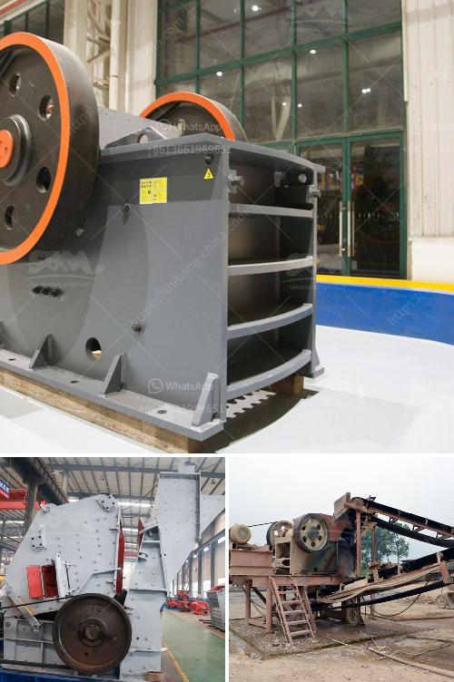

<h3>small scale mining equipment price in zimbabwe</h3>
Small-scale mining in Zimbabwe has become an important economic activity that contributes significantly to the country's rural development. Unfortunately, the sector faces various challenges, including a lack of proper equipment, high production costs, and lack of access to markets. However, with the right equipment, miners can maximize their productivity and reduce costs, ensuring a sustainable and profitable operation.

When it comes to small-scale mining equipment in Zimbabwe, prices can vary widely depending on the type of machinery needed. In general, equipment prices range from affordable to relatively expensive. However, it is important to note that the price should not be the sole determining factor when purchasing mining equipment. Quality, durability, and reliability are vital considerations to ensure the longevity and efficiency of the equipment.

For instance, a basic gold pan, which is essential for panning and recovering gold, can cost around $5 to $10. A more sophisticated option, such as a high-quality metal detector, can range from $400 to $2000, depending on the brand and specifications. Additionally, gold crushers, amalgam barrels, and ball mills can cost several hundred to a few thousand dollars.

To make mining more affordable, some manufacturers offer rental options or have financing plans available. This can help small-scale miners overcome financial barriers and access the necessary equipment. Furthermore, cooperatives and government initiatives often provide assistance in acquiring equipment at reduced prices or through subsidies.

It is crucial for small-scale miners to conduct thorough research, compare prices, and assess the needs of their operations before investing in mining equipment. Consulting with experienced miners, local suppliers, or industry experts can provide valuable insights and ensure informed decision-making.

While prices of mining equipment in Zimbabwe may vary, it is important to strike a balance between cost and quality. Investing in durable, reliable, and efficient equipment will pay off in the long run by maximizing productivity, reducing operational costs, and ensuring sustainable livelihoods for small-scale miners.
<h3>Contact us</h3><ul><li><strong>Whatsapp:&nbsp;<a href="https://wa.me/8613661969651">+8613661969651</a></strong></li><li><a href="https://swt.shibang-china.com/?git&amp;zhl&amp;small scale mining equipment price in zimbabwe"><strong>Online Service(chat now)</strong></a></li></ul><h3>Related</h3><ul><li><a href='distributor cone crusher indonesia.md'>distributor cone crusher indonesia</a></li><li><a href='quarry crusher philippines.md'>quarry crusher philippines</a></li><li><a href='sample business plan for crushed stone.md'>sample business plan for crushed stone</a></li><li><a href='limestone crushing plant manufacturer.md'>limestone crushing plant manufacturer</a></li><li><a href='stone crusher equipment for sale.md'>stone crusher equipment for sale</a></li></ul>