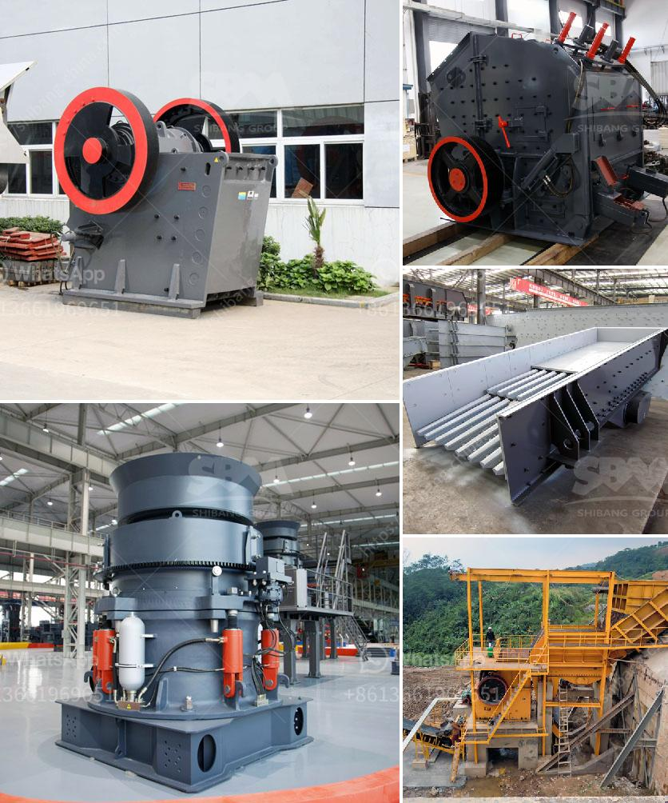

<h3>small scale mining partnership crusher</h3>
Small scale mining is a significant contributor to the overall mining industry globally. According to the International Labour Organization (ILO), this sector employs over 40 million people worldwide, with many engaged in low-tech, labor-intensive activities. While small scale mining is essential for local economies and poverty alleviation, it often faces numerous challenges, such as lack of modern equipment and limited access to financing. However, partnerships with industry players, such as the provision of crushers, can play a crucial role in addressing these barriers and promoting sustainable development.

One key aspect of small scale mining is the extraction of minerals and ores, which requires crushing and processing. Traditionally, miners used manual methods, such as using hammers and pestles, to break down rocks. This labor-intensive process not only posed serious health risks to the workers but also resulted in low productivity levels. However, with the advent of modern crushers, small scale miners now have access to efficient and safer equipment.

A crucial element in the success of small scale mining partnerships involving crushers is the collaboration between different stakeholders. This includes governments, mining companies, non-governmental organizations, and local communities. Such partnerships can help address various challenges such as access to capital, training opportunities, and the adoption of sustainable practices.

First and foremost, the provision of crushers by mining companies or other stakeholders can significantly improve productivity and safety. Crushers are designed to efficiently break down rocks, making the extraction process more efficient and reducing the need for manual labor. This results in increased productivity and income for miners while reducing their exposure to health hazards such as dust inhalation.

Partnerships can also focus on offering training programs to small scale miners. These programs can equip miners with the necessary skills to operate and maintain crushers effectively. Additionally, miners can receive training on safety measures, including the proper use of personal protective equipment (PPE). By empowering miners with knowledge and skills, partnerships enable them to work more efficiently, safely, and sustainably.

Another crucial aspect of small scale mining partnerships is access to financing and support. Financial institutions and mining companies can play a vital role in providing small scale miners with access to capital, enabling them to invest in modern crushers and other necessary equipment. Additionally, partnerships can facilitate access to markets, where small scale miners can sell their products and receive fair prices for their minerals. Such support helps improve livelihoods and encourages a sustainable mining industry.

In conclusion, small scale mining partnerships that provide crushers are essential for promoting sustainable development and improving the overall well-being of the sector. By replacing traditional, labor-intensive methods with modern equipment, crushers enhance productivity and safety. Collaborations between governments, mining companies, NGOs, and local communities can address challenges such as access to training and financing, creating a conducive environment for sustainable mining practices. With the collective effort of all stakeholders, small scale mining can thrive, contributing to economic growth and poverty reduction while minimizing the environmental impact.
<h3>Contact us</h3><ul><li><strong>Whatsapp:&nbsp;<a href="https://wa.me/8613661969651">+8613661969651</a></strong></li><li><a href="https://swt.shibang-china.com/?git&amp;zhl&amp;small scale mining partnership crusher"><strong>Online Service(chat now)</strong></a></li></ul><h3>Related</h3><ul><li><a href='gypsum ball mill manufacturing machine.md'>gypsum ball mill manufacturing machine</a></li><li><a href='iron ore pellet plant in odisha.md'>iron ore pellet plant in odisha</a></li><li><a href='crusher how to calculate the cost of returns.md'>crusher how to calculate the cost of returns</a></li><li><a href='concrete crusher price.md'>concrete crusher price</a></li><li><a href='used copper process plants for sale.md'>used copper process plants for sale</a></li></ul>