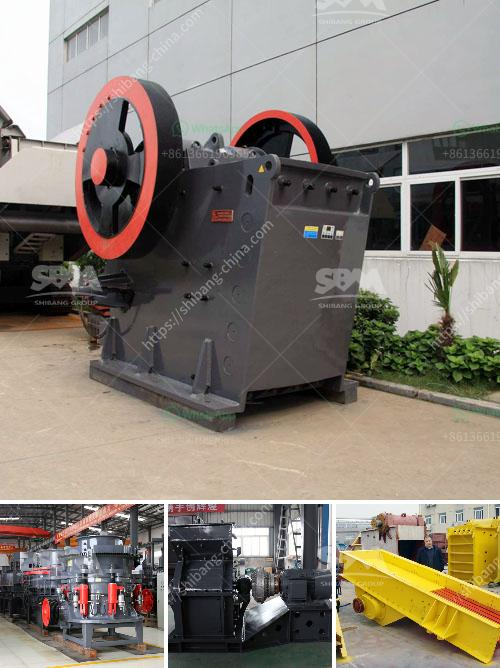

<h3>small scale mining rock crushers for sale</h3>
Small scale mining is an integral part of the mining industry, contributing significantly to global mineral production and providing livelihoods to millions of people worldwide. However, small scale mining operations often use rudimentary equipment that lacks efficiency, resulting in low productivity and reduced profits. One crucial piece of equipment that can enhance the efficiency of small scale mining operations is a rock crusher.

Rock crushers are designed to break up hard rock to a manageable size for transportation and further processing. They can be used in a variety of applications, including mining, construction, and demolition, to crush rebar and other unwanted materials commonly found in demolished buildings. Small scale mining rock crushers for sale provide a more reliable alternative to the traditional rudimentary tools used in such operations.

Understandably, these rock crushers are powerful pieces of equipment, and they can be quite expensive. Luckily, there are many affordable options available in the market today. Various manufacturers offer small scale mining rock crushers for sale at reasonable prices. You can find models ranging from basic manual devices to highly sophisticated automated ones.

Investing in a rock crusher for small scale mining will provide a cost-effective and reliable solution that can significantly improve productivity and profitability. In addition to crushing hard rock, these machines can also be used to crush glass, gold-bearing ores, granite, manganese ore, quartz, and other mineral rocks.

When purchasing a rock crusher for small scale mining, it's essential to evaluate various factors that ensure quality and value for money. Key considerations include the crusher's size, weight, capacity, power consumption, and ease of use. It's recommended to choose a model that meets your specific requirements and offers ease of maintenance and durability.

In conclusion, small scale mining rock crushers for sale provide the ideal solution for the unique challenges faced in small scale mining operations. They offer flexibility in terms of adaptability and are easy to operate, making them an attractive investment for any small scale miner looking to enhance their operations. With the numerous options available in the market, there is undoubtedly a rock crusher suitable for every small scale mining operation.
<h3>Contact us</h3><ul><li><strong>Whatsapp:&nbsp;<a href="https://wa.me/8613661969651">+8613661969651</a></strong></li><li><a href="https://swt.shibang-china.com/?git&amp;zhl&amp;small scale mining rock crushers for sale"><strong>Online Service(chat now)</strong></a></li></ul><h3>Related</h3><ul><li><a href='drums of conveyor belts malaysia.md'>drums of conveyor belts malaysia</a></li><li><a href='three roll milling italy.md'>three roll milling italy</a></li><li><a href='hammer mill machine buy.md'>hammer mill machine buy</a></li><li><a href='ball mill company in tamilnadu.md'>ball mill company in tamilnadu</a></li><li><a href='diamond stone crusher.md'>diamond stone crusher</a></li></ul>