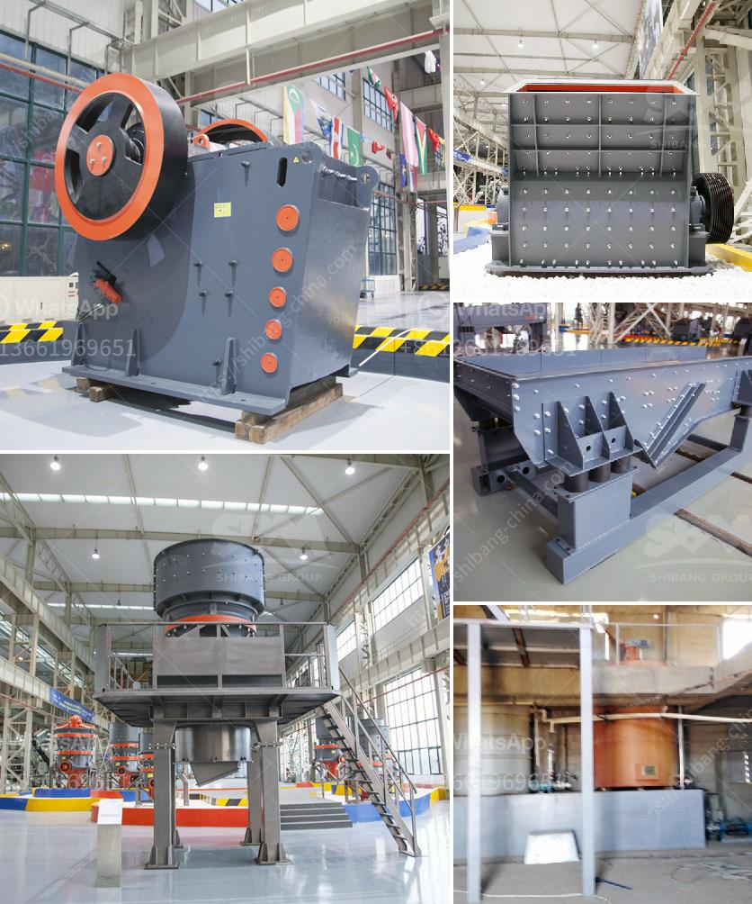

<h3>small scale quarry mining equipment</h3>
Quarry mining is a tough job. It is highly demanding and takes a strong level of determination and expertise to work in this field. Small scale quarry miners agree that the right equipment makes a big difference in their productivity levels.

In today's mining industry, the high competition and the accelerating pace of technology change demand that quarry mining businesses remain up-to-date with the latest equipment advancements. Small scale quarry miners need machinery that is efficient and cost-effective to reach their full potential while providing a sustainable future for both the environment and their business.

One crucial aspect of quarry mining is safety. Accidents can happen at any time, and the consequences can be severe. Therefore, small scale quarry miners must invest in equipment designed to minimize risks. Modern technology has made it possible to develop machinery that improves both worker safety and overall efficiency.

Portable rock crushers, drilling rigs, and screening equipment can be utilized to enhance the safety measures on site. These machines come with advanced features like remote control operation, which enables operators to maintain a safe distance from the equipment during operation. Some machines also utilize GPS tracking systems to ensure workers' locations are always known on-site, reducing the risk of accidents.

Another vital aspect of small scale quarry mining is cost-efficiency. With limited budgets and resources, it is essential for miners to invest in the right equipment that provides long-term value for money. As the market evolves, manufacturers have optimized their mining machinery to be more fuel-efficient, reducing overall costs in the long run.

Some equipment now offers the option to switch between electric and diesel power, allowing operators to choose the most cost-effective energy source in different situations. In addition to fuel efficiency, modern machinery is designed to be robust and durable, reducing maintenance costs and machine downtime.

The environmental impact of quarry mining is also a significant concern for small scale miners. Sustainable mining practices are becoming increasingly critical in the industry. Environmental responsibility can help miners gain community trust and enhance their reputation.

Manufacturers are continuously developing machinery with features that minimize environmental impact. For example, dust suppression systems are now a standard feature on most crushers and drilling rigs, helping to mitigate dust pollution. Additionally, water recycling systems have been integrated into many screening equipment devices, reducing water usage and enabling more sustainable operations.

In conclusion, small scale quarry miners must invest in the right equipment to improve productivity, safety, cost-efficiency, and environmental sustainability. With the right machinery, miners can maximize their potential and create a positive impact on their business and the communities they operate in.

The mining industry is continuously evolving, and small scale quarry miners must stay informed about the latest equipment advancements. Keeping up with technological advancements is crucial for small scale quarry miners to remain competitive and ensure a sustainable future. By investing in modern machinery designed for safety, cost-efficiency, and environmental responsibility, small scale quarry miners can thrive in today's mining industry.
<h3>Contact us</h3><ul><li><strong>Whatsapp:&nbsp;<a href="https://wa.me/8613661969651">+8613661969651</a></strong></li><li><a href="https://swt.shibang-china.com/?git&amp;zhl&amp;small scale quarry mining equipment"><strong>Online Service(chat now)</strong></a></li></ul><h3>Related</h3><ul><li><a href='industrial fine powder grinder.md'>industrial fine powder grinder</a></li><li><a href='pulverizer crusher manufacturer in pune.md'>pulverizer crusher manufacturer in pune</a></li><li><a href='primary crusher ball milling pengertian.md'>primary crusher ball milling pengertian</a></li><li><a href='quarry crusher for sales in germany.md'>quarry crusher for sales in germany</a></li><li><a href='grinding mills for sale philippines.md'>grinding mills for sale philippines</a></li></ul>