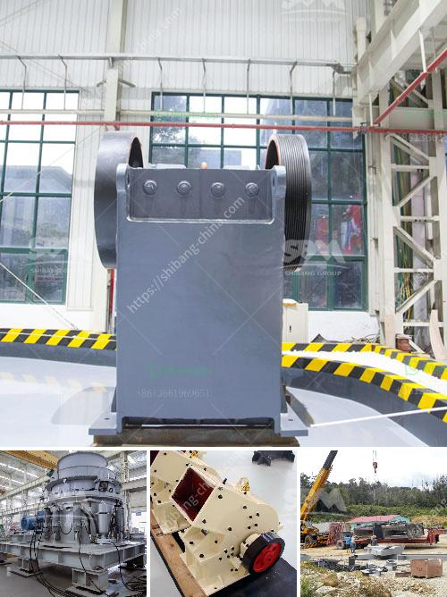

<h3>small size gold mining business plan</h3>
Starting a small-scale gold mining business can involve a range of challenges to navigate, but with careful planning and execution, it has the potential to become a profitable venture. A well-crafted business plan is essential for laying out a roadmap for success.

Firstly, conducting thorough research on the local gold reserves and determining the viability of mining in the chosen area is crucial. Assessing the geological potential, permits and licenses required, and potential competitors operating in the vicinity are key considerations.

Following this, estimating the initial investment required for the operation is essential. This may include expenses related to equipment, labor, site development, and purchasing or leasing the necessary machinery, such as dredges, crushers, or wash plants. It is important to strike a balance between cost-effectiveness and ensuring adequate resources are allocated to maximize productivity.

Furthermore, outlining a detailed operational plan that includes exploration activities, mining techniques, and processing methods is vital. Identifying the target output and potential sales channels will enable the business to align with customer demands and market trends, ensuring a competitive edge.

Environmental sustainability and responsible mining practices must also be incorporated into the plan. Implementing strategies to minimize the impact on the ecosystem and local communities will not only ensure compliance with regulatory requirements but also foster a positive reputation in the industry.

Additionally, formulating marketing and sales strategies to reach potential buyers and negotiate favorable contracts is paramount. Establishing relationships with refining companies, jewelry manufacturers, or investors can be instrumental in securing long-term partnerships and off-take agreements.

Finally, financial projections, including revenue forecasts, cash flow analysis, and ROI estimates, should be developed to ascertain the profitability and potential payback period of the business. This will provide a clear understanding of financial requirements and aid in attracting investors or acquiring loans if needed.

In summary, a well-thought-out business plan is fundamental for anyone keen on establishing a small-scale gold mining business. It serves as a roadmap, outlining strategies for exploration, mining, processing, and marketing while considering environmental sustainability and financial viability. With meticulous planning and execution, such a venture has the potential to yield substantial profits in the long run.
<h3>Contact us</h3><ul><li><strong>Whatsapp:&nbsp;<a href="https://wa.me/8613661969651">+8613661969651</a></strong></li><li><a href="https://swt.shibang-china.com/?git&amp;zhl&amp;small size gold mining business plan"><strong>Online Service(chat now)</strong></a></li></ul><h3>Related</h3><ul><li><a href='industrial crusher for sale.md'>industrial crusher for sale</a></li><li><a href='quarry crushing plants in south africa.md'>quarry crushing plants in south africa</a></li><li><a href='balls for ball mill in india.md'>balls for ball mill in india</a></li><li><a href='machine to crush limestone in south africa.md'>machine to crush limestone in south africa</a></li><li><a href='ball mills for large mining.md'>ball mills for large mining</a></li></ul>