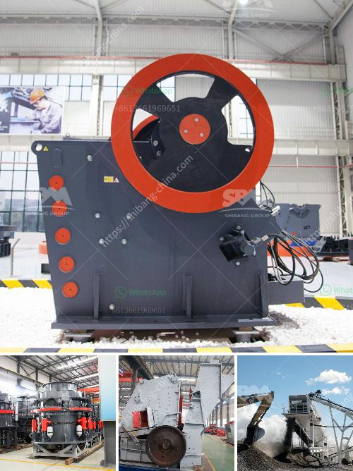

<h3>small stone crusher in kenya</h3>
In recent years, the production of small stone crushers in Kenya has been increasing, and the market demand for stone crushers in Kenya is increasing too. Small stone crusher is suitable for crushing more than 100 kinds of medium and above hardness materials, compression wear-resistant, wear-resistant parts, durable, strong, wear-resistant, reliable, easy maintenance and other characteristics. It is widely used in various fields of mining, metallurgy, building materials, railway, water conservancy, chemical industry, etc. The development of small stone crushers in Kenya is driven by the development of stone resources and the increasing market demand for stone materials.

In Kenya, there are abundant mineral resources. Kenya is a mineral-rich country, with minerals such as soda ash, fluorspar, limestone, barite, gold, silver, copper, aluminum, zinc, niobium and thorium. Small stone crushers in Kenya mainly refers to the crusher used in the quarrying industry. The Kenya economy is dominated by the agricultural and service sectors. Mining, industrial manufacturing, construction and energy are the four pillars of the Kenyan economy.

As the infrastructure construction continues to develop in Kenya, the demand for gravel aggregates is also increasing. In addition, with the rapid development of e-commerce, the sales model of small stone crushers in Kenya has also been greatly changed. More and more investors are purchasing small stone crushers in Kenya online, and sending them directly to the construction site.

In the mining and construction industry, 1-10t/h, mobile jaw crusher and 10-40t/h, mobile impact crusher production models are widely used, and has attracted many customers from different countries. The models are suitable for different production requirements of small stone crushers in Kenya.

The maintenance of small stone crushers in Kenya is also very important. The maintenance of the equipment is mainly to reduce the wear and tear of the equipment, ensure the normal operation of the equipment, and extend the service life of the equipment. The more mines are crushed, the more severe the wear and tear of the equipment, and the frequent maintenance of the equipment requires professional guidance.

In conclusion, the development of small stone crushers in Kenya is driven by the development of stone resources and the increasing market demand for stone materials. With the improvement of scientific and technological level, the increase of infrastructure construction in Kenya, and the continuous improvement of automation technology in stone crushers, the market prospect of small stone crushers in Kenya is very broad. The small stone crusher has a great market demand in the future, and users have a strong purchasing power. It is necessary to choose the suitable small stone crusher according to different mining requirements.
<h3>Contact us</h3><ul><li><strong>Whatsapp:&nbsp;<a href="https://wa.me/8613661969651">+8613661969651</a></strong></li><li><a href="https://swt.shibang-china.com/?git&amp;zhl&amp;small stone crusher in kenya"><strong>Online Service(chat now)</strong></a></li></ul><h3>Related</h3><ul><li><a href='size pe 600x900 jaw crusher.md'>size pe 600x900 jaw crusher</a></li><li><a href='stone principle crusher project.md'>stone principle crusher project</a></li><li><a href='milling equipment for talcum powder.md'>milling equipment for talcum powder</a></li><li><a href='how to grind silica sand.md'>how to grind silica sand</a></li><li><a href='gold mining equipment manufacturers in europe.md'>gold mining equipment manufacturers in europe</a></li></ul>