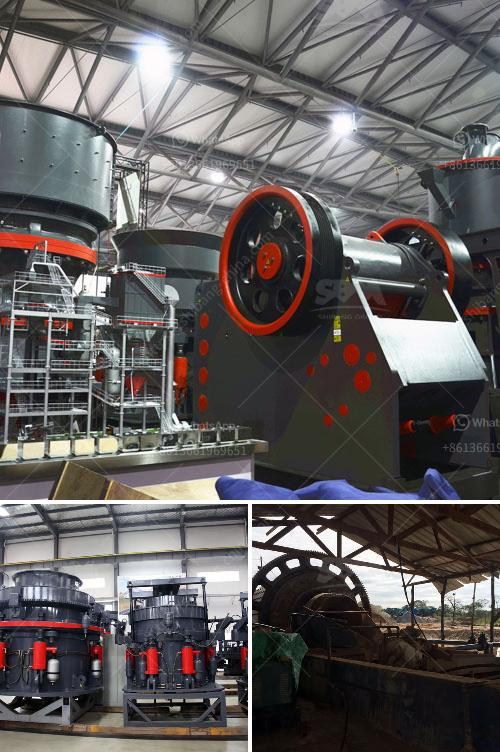

<h3>south africa biggest chrome wash plant</h3>
South Africa has been one of the world's largest producers of chrome ore for decades, and it consistently ranks as one of the top chrome ore producing countries in the world. With such prominence in the market, it comes as no surprise that the country is home to some of the largest chrome wash plants globally.

One of South Africa's biggest chrome wash plants is located in the Steelpoort mining belt in the Limpopo province. Owned by Samancor Chrome, this plant is capable of producing an impressive 2 million tons of chrome ore annually. The chrome wash plant is part of Samancor's Western Chrome Mines division.

The plant is situated near the town of Steelpoort, which is strategically located along the eastern rim of the country's Bushveld Igneous Complex. This complex is known for its rich deposits of platinum, chrome, and other valuable minerals. Being in close proximity to this resource-filled area allows the chrome wash plant to efficiently extract chrome ore for processing.

The plant's operations are carried out in several stages, starting with the excavation of chrome ore from the mine. Giant earthmoving equipment is used to dig and transport the ore to the plant. Once there, the ore is subjected to a series of processes to convert it into a usable form. These include screening, washing, crushing, and gravity separation.

The chrome wash plant employs state-of-the-art technology and equipment to ensure maximum efficiency and productivity. The ore undergoes thorough washing to remove any impurities and foreign matter. Depending on the ore grade, additional processes such as magnetic separation or flotation may be employed to further enhance the chrome concentration.

The final step in the process involves the drying and packaging of the chrome concentrate. This concentrated form of chrome is then transported to various smelters for further processing. The smelters play a crucial role in converting chrome concentrate into ferrochrome, an alloy used in the production of stainless steel and other high-strength materials.

Apart from its impressive production capacity, the chrome wash plant also contributes significantly to the local economy. It provides employment opportunities for countless South Africans, both directly and indirectly. The plant supports local businesses that provide services such as equipment maintenance, transportation, and supplies.

In conclusion, South Africa's biggest chrome wash plant is a testament to the country's rich mineral resources and its ability to leverage them for economic growth. The plant's operations not only contribute to the global supply of chrome ore but also provide employment opportunities and support local businesses. With its state-of-the-art technology and efficient processes, this chrome wash plant remains a vital asset in South Africa's mining industry.
<h3>Contact us</h3><ul><li><strong>Whatsapp:&nbsp;<a href="https://wa.me/8613661969651">+8613661969651</a></strong></li><li><a href="https://swt.shibang-china.com/?git&amp;zhl&amp;south africa biggest chrome wash plant"><strong>Online Service(chat now)</strong></a></li></ul><h3>Related</h3><ul><li><a href='tph jaw crusher price.md'>tph jaw crusher price</a></li><li><a href='stone quarry process.md'>stone quarry process</a></li><li><a href='stone crush machine price in pakistan.md'>stone crush machine price in pakistan</a></li><li><a href='how to start a stone crushing business nigeria.md'>how to start a stone crushing business nigeria</a></li><li><a href='costo de la planta de procesamiento de coltan.md'>costo de la planta de procesamiento de coltan</a></li></ul>