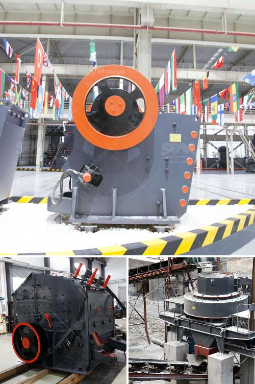

<h3>south africa used chrome ore mining crushing equipment</h3>
South Africa is one of the largest producers of chrome ore in the world, contributing to an estimated 35% of global production. The country holds vast chrome ore reserves, making it a prominent player in the mining industry. Chrome ore is used in the production of ferrochrome, which is an essential component in the manufacturing of stainless steel.

To extract chrome ore, the ore is first crushed and screened, with the assistance of crushers and sieves. Once separated, the ferrochrome is further refined through various processes such as smelting and refining, resulting in a high-quality end product.

Chrome ore mining requires the use of crushing equipment. Crushing equipment is used to crush and grind large rocks and other materials into smaller pieces or powder form. This enables easy separation of the valuable minerals from the waste material.

The use of crushing equipment comes with numerous benefits in chrome ore mining. Firstly, it enhances the efficiency of the extraction process. By breaking down the rocks into smaller sizes, the valuable chrome ore can be easily separated and further processed. This increases the overall productivity of the mining operations.

Additionally, crushing equipment helps in the optimization of ore transportation. The crushed material can be transported more easily and efficiently, reducing the cost and time associated with transportation. This enables mining companies to maximize their profits while minimizing operational costs.

Moreover, the use of crushing equipment ensures uniformity in the size of the extracted chrome ore. This is crucial in maintaining consistent quality standards in the production of ferrochrome. Uniformly sized ore particles reduce the chances of inconsistencies in the smelting and refining processes, resulting in high-quality ferrochrome.

There are various types of crushing equipment utilized in chrome ore mining. Jaw crushers, gyratory crushers, and cone crushers are commonly used for primary crushing operations. Cone crushers and impact crushers are often employed for secondary and tertiary crushing stages. Each type of crusher has its own advantages and is selected based on the specific requirements of the mining operation.

In recent years, South African mining companies have invested significantly in modernizing their crushing equipment. Advanced technologies and automation have been integrated into the crushing systems, further enhancing their efficiency and productivity. This has not only improved the extraction process but also helped in reducing the environmental impact of the mining operations.

However, challenges remain in the chrome ore mining industry. The fluctuating global chrome ore prices, as well as geopolitical and socio-economic factors, can impact the profitability of the mining operations. Additionally, environmental concerns such as water usage and waste management need to be addressed by implementing sustainable mining practices.

In conclusion, the use of crushing equipment in chrome ore mining plays a crucial role in the extraction and processing of this valuable resource. It improves operational efficiency, ensures consistent quality standards, and supports sustainable mining practices. As South Africa continues to be a key player in the global chrome ore market, investments in advanced crushing equipment will remain essential for the industry's growth and success.
<h3>Contact us</h3><ul><li><strong>Whatsapp:&nbsp;<a href="https://wa.me/8613661969651">+8613661969651</a></strong></li><li><a href="https://swt.shibang-china.com/?git&amp;zhl&amp;south africa used chrome ore mining crushing equipment"><strong>Online Service(chat now)</strong></a></li></ul><h3>Related</h3><ul><li><a href='how to design iron ore plant.md'>how to design iron ore plant</a></li><li><a href='crushers for sale in.md'>crushers for sale in</a></li><li><a href='quarry crusher philippines.md'>quarry crusher philippines</a></li><li><a href='calcium carbonate milling machine.md'>calcium carbonate milling machine</a></li><li><a href='gold processing per hour.md'>gold processing per hour</a></li></ul>