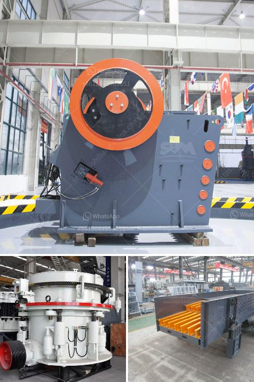

<h3>spec vibrating screen</h3>
Spec vibrating screens, also known as specification screens, are widely used in various industries for separating materials of different sizes. This powerful screening equipment is capable of handling large quantities of materials, ensuring efficient operations and elevated productivity. In this article, we will explore the functions, advantages, and applications of spec vibrating screens.

Spec vibrating screens consist of a screen box made of high-strength steel to handle heavy loads. Inside the box, multiple screening decks are positioned at different angles, allowing for efficient separation of materials. These screens can be inclined or horizontal, depending on the specific requirements of the application. The screens are made of durable and corrosion-resistant wire mesh, perforated plates, or synthetic materials, depending on the material being screened.

The working principle of spec vibrating screens involves the use of centrifugal force generated by the rotating eccentric weights. As the weights rotate, they cause the screen box to vibrate in a circular motion, creating an effective material separation. The vibration intensity can be adjusted to achieve the desired screening efficiency.

1. Enhanced Sorting Accuracy: Spec vibrating screens are adept at accurately separating materials according to their sizes. This ensures the desired quality and reduces the risk of contamination by oversized or undersized particles.

2. Higher Screening Efficiency: The circular motion of the screen box enables better material flow, ensuring larger screening capacities. This heightened efficiency translates into higher productivity and reduced downtime.

3. Versatility: Spec vibrating screens can handle various materials, including aggregates, ores, coal, and recyclables. With different screen mesh options available, these screens can be used for fine, medium, or coarse particle separations.

4. Low Maintenance: Due to their sturdy construction and minimal moving parts, spec vibrating screens require minimal maintenance. This leads to reduced downtime and lower operational costs.

5. Customizable Configurations: Spec vibrating screens can be tailored to meet specific requirements. Depending on the application, different screen sizes, deck arrangements, and additional features can be incorporated.

- Chemical and Food Processing: Sort and classify different chemical powders, granules, and food ingredients based on their sizes.

- Recycling and Waste Management: Separate recyclable materials such as plastics, metals, and paper from general waste, increasing the recovery rate.

- Construction: Screen and separate construction materials such as sand, gravel, and stone for concrete production.

Spec vibrating screens are indispensable screening machines that offer remarkable efficiency and accuracy in separating materials of different sizes. With customizable configurations, these screens can be adapted to suit various applications across multiple industries. By enhancing productivity and reducing maintenance, spec vibrating screens contribute significantly to overall operational efficiency.
<h3>Contact us</h3><ul><li><strong>Whatsapp:&nbsp;<a href="https://wa.me/8613661969651">+8613661969651</a></strong></li><li><a href="https://swt.shibang-china.com/?git&amp;zhl&amp;spec vibrating screen"><strong>Online Service(chat now)</strong></a></li></ul><h3>Related</h3><ul><li><a href='coal transfer conveyor supplier in china.md'>coal transfer conveyor supplier in china</a></li><li><a href='coal powder making machine.md'>coal powder making machine</a></li><li><a href='ball mills for grinding lime.md'>ball mills for grinding lime</a></li><li><a href='chalcopyrite ore processing plant cost to built and sale.md'>chalcopyrite ore processing plant cost to built and sale</a></li><li><a href='companies crushing plant.md'>companies crushing plant</a></li></ul>