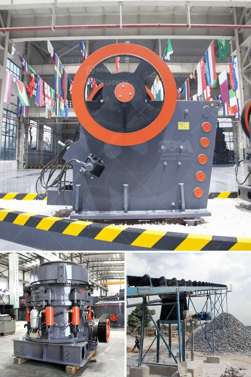

<h3>specification of jaw crusher</h3>
A jaw crusher is a machine that breaks building materials such as rocks, mountains, and other hard materials into smaller pieces. Jaw crushers are most often seen in mining or disposal, where they are used to break objects into smaller pieces. Used in processing facilities and on construction sites, jaw crushers can be found as stationary machines installed in a building or as mobile crushers mounted on a trailer or truck.

The jaw crusher machine is composed of two jaw plates, the moving jaw and the static jaw. The moving jaw forms a V-shaped structure with the static jaw. The crushing chamber is formed by the two jaw plates. The moving jaw moves back and forth against the fixed jaw, and the crushed material is discharged from the bottom of the crushing chamber.

The specification of jaw crushers includes the maximum crushing capacity of the material, which is determined by the type and property of the material to be crushed, the input size of the material, the compression strength of the material, the type of toothed plate and its configuration, and the discharge size adjustment range.

The maximum crushing capacity of the jaw crusher refers to the amount of crushed material in the unit time. It is usually expressed in tons/hour. The specific value depends on the characteristics of the material being crushed, such as hardness, viscosity, and humidity. In general, the higher the hardness and viscosity of the material, the smaller the crushing capacity.

The input size of the material refers to the maximum size of the material to be fed into the jaw crusher. The input size is usually determined by the size of the feeding port, which is typically specified in millimeters. The size of the feeding port should be slightly larger than the maximum size of the material to ensure smooth feeding operation and avoid blockage.

The compression strength of the material refers to the maximum force that the material can withstand under compression. It is usually expressed in megapascals (MPa). The compression strength of the material is an important factor to consider when selecting a jaw crusher. If the compression strength of the material exceeds the maximum strength of the jaw crusher, the jaw plates may be damaged or the crusher may fail to crush the material effectively.

The type and configuration of the toothed plate are also important factors to consider when selecting a jaw crusher. The toothed plate is the main wearing part of the jaw crusher, and its quality directly affects the crushing efficiency and service life of the jaw crusher. There are various toothed plate materials available, such as high manganese steel, alloy steel, and composite materials, each with its own advantages and disadvantages.

The discharge size adjustment range refers to the range of discharge sizes that can be achieved by adjusting the position of the toggle plate. The toggle plate is used to adjust the discharge size of the crushed material by changing the angle between the two jaw plates. The larger the adjustment range, the more flexible the jaw crusher is in terms of controlling the final product size.

In conclusion, the specification of a jaw crusher includes the maximum crushing capacity, input size, compression strength, toothed plate type and configuration, and discharge size adjustment range. These specifications are important factors to consider when selecting a jaw crusher for specific applications.
<h3>Contact us</h3><ul><li><strong>Whatsapp:&nbsp;<a href="https://wa.me/8613661969651">+8613661969651</a></strong></li><li><a href="https://swt.shibang-china.com/?git&amp;zhl&amp;specification of jaw crusher"><strong>Online Service(chat now)</strong></a></li></ul><h3>Related</h3><ul><li><a href='manufacturing process of portland slag cement.md'>manufacturing process of portland slag cement</a></li><li><a href='machinery for quartz stone.md'>machinery for quartz stone</a></li><li><a href='iron ore crushing equipment cost.md'>iron ore crushing equipment cost</a></li><li><a href='dolomite crusher turkey 200 ton price.md'>dolomite crusher turkey 200 ton price</a></li><li><a href='calcium carbonate factory costs.md'>calcium carbonate factory costs</a></li></ul>