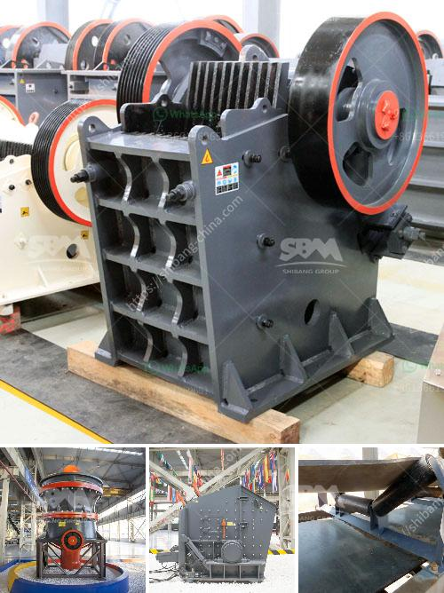

<h3>start a quarry plant</h3>
Starting a quarry plant is not an easy task as it requires a lot of planning, patience, and hard work. If you are considering entering this industry, you should do thorough research and seek professional advice to ensure that your venture is successful.

First and foremost, you need to identify a suitable location for your quarry plant. This should be an area rich in natural resources such as limestone, granite, or sandstone, depending on the type of quarry you intend to operate. Conduct geological surveys to determine the quality and quantity of the materials available.

Once you have found a suitable location, you need to obtain the necessary permits and licenses from the relevant authorities. This process may vary depending on your location, but generally, you will need to submit an application detailing your proposed quarrying activities. Environmental impact assessments may also be required to ensure that your operations comply with local regulations.

Next, you need to secure the necessary funding to start your quarry plant. The cost of setting up a quarry can vary greatly depending on the size, equipment, and resources required. A small quarry might cost as little as $500,000, while a larger operation can exceed $10 million. To ensure you receive the necessary funding, you should prepare a comprehensive business plan outlining your projected income and expenses, as well as your marketing strategy.

Investing in quality equipment is crucial for the success of your quarry plant. Depending on your needs, you may require crushers, excavators, loaders, and trucks to transport the extracted materials. It is important to choose reliable and durable machinery that can withstand the demands of a quarrying operation. Regular maintenance and repairs are also necessary to keep your equipment in good condition and minimize costly downtime.

Safety should be a top priority in your quarry plant. Quarrying can be a hazardous activity, with potential risks such as rockfalls, machinery accidents, and exposure to harmful dust. Implementing proper safety measures, providing training for your employees, and conducting regular inspections can help ensure a safe working environment.

Marketing your quarry plant is essential to attract customers and generate income. Identify potential clients such as construction companies, road builders, and landscapers, and promote your products and services to them. Attending industry trade shows, establishing an online presence, and networking with other professionals in the field can also help increase awareness of your quarry plant.

Finally, as with any business, it is important to monitor your operations and make necessary adjustments along the way. Regularly review your financial statements, production efficiency, and customer satisfaction to identify areas for improvement. Adapting to changing market conditions and staying informed about industry trends and innovations can also give you a competitive edge.

Starting a quarry plant can be a challenging endeavor, but with careful planning and determination, it can also be a rewarding one. By following these steps and seeking the necessary advice and assistance, you can pave the way for a successful quarrying operation and contribute to the growth of the construction industry.
<h3>Contact us</h3><ul><li><strong>Whatsapp:&nbsp;<a href="https://wa.me/8613661969651">+8613661969651</a></strong></li><li><a href="https://swt.shibang-china.com/?git&amp;zhl&amp;start a quarry plant"><strong>Online Service(chat now)</strong></a></li></ul><h3>Related</h3><ul><li><a href='mobile crusher 100tph.md'>mobile crusher 100tph</a></li><li><a href='harga mobile crusher 100tph.md'>harga mobile crusher 100tph</a></li><li><a href='cost gypsum processing machines.md'>cost gypsum processing machines</a></li><li><a href='supplier of gold desorption plant in china.md'>supplier of gold desorption plant in china</a></li><li><a href='calcium carbonate crushers.md'>calcium carbonate crushers</a></li></ul>