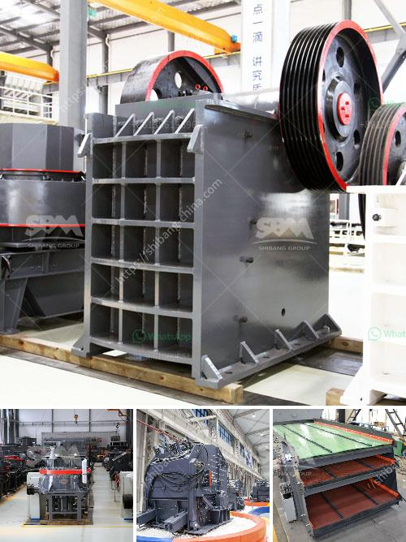

<h3>stationary stone crushers made in china</h3>
Stationary stone crushers made in China have been widely used in construction fields, mining industries, and other places. Stationary stone crushers provide high quality materials for various construction needs. With advanced technology and excellent reliability, stationary stone crushers are popular for crushing stones into different sizes.

One of the key advantages of stationary stone crushers is their ability to crush large rocks into smaller rocks or gravel. This helps in creating a more uniform and compact material suitable for construction projects. These crushers can handle a wide range of materials, from limestone to granite and from hard rock to soft rock. With their powerful crushing capacity, they can produce quality aggregates that meet the specific requirements of construction projects.

Stationary stone crushers also offer many benefits in terms of energy efficiency and operational cost reduction. Compared to mobile stone crushers, stationary crushers require less transportation and can operate in a fixed location for an extended period. This eliminates the need for frequent relocation, reducing fuel consumption and transportation costs. Additionally, stationary stone crushers typically have a higher processing capacity, resulting in higher productivity and lower operational costs.

China is one of the leading manufacturers of stationary stone crushers. Chinese crusher manufacturers have mastered the art of manufacturing high quality, durable, and efficient machines. These crushers are known for their diverse range of features, size options, and capabilities. The crushing process itself is a result of the principles of interparticle crushing. It works by utilizing a mantle and a concave located within a fixed outer crushing chamber. These crushers employ a compression force to break the particles, resulting in a more consistent and precise product.

China's stationary stone crushers are extensively used in mining, building materials, highways, railways, water conservancy, metallurgy, and other fields. The finished materials with different particle sizes can be applied to various construction projects. As a result, stationary stone crushers are increasingly in demand.

Not only are Chinese stationary stone crushers reliable and efficient, but they also come with excellent after-sales service. Chinese manufacturers value their customers and ensure that technical support is readily available. Spare parts are easily accessible, and maintenance services are provided to ensure smooth operation of the machines. This commitment to customer satisfaction has made Chinese stationary stone crushers a popular choice among global buyers.

In conclusion, stationary stone crushers made in China offer numerous advantages for construction projects. Their ability to crush large rocks into smaller, uniform materials makes them ideal for various applications. They are energy-efficient, cost-effective, and reliable, with high-quality craftsmanship. Chinese manufacturers have mastered the art of producing stationary stone crushers with excellent after-sales service, ensuring customer satisfaction. With their advanced technology, these crushers are poised to continue making a significant impact in the construction industry.
<h3>Contact us</h3><ul><li><strong>Whatsapp:&nbsp;<a href="https://wa.me/8613661969651">+8613661969651</a></strong></li><li><a href="https://swt.shibang-china.com/?git&amp;zhl&amp;stationary stone crushers made in china"><strong>Online Service(chat now)</strong></a></li></ul><h3>Related</h3><ul><li><a href='cement making process.md'>cement making process</a></li><li><a href='gold mining equipment manufacturers in europe.md'>gold mining equipment manufacturers in europe</a></li><li><a href='limestone crusher india.md'>limestone crusher india</a></li><li><a href='caco3 plant parts.md'>caco3 plant parts</a></li><li><a href='dolomite crusher turkey 200 ton price.md'>dolomite crusher turkey 200 ton price</a></li></ul>