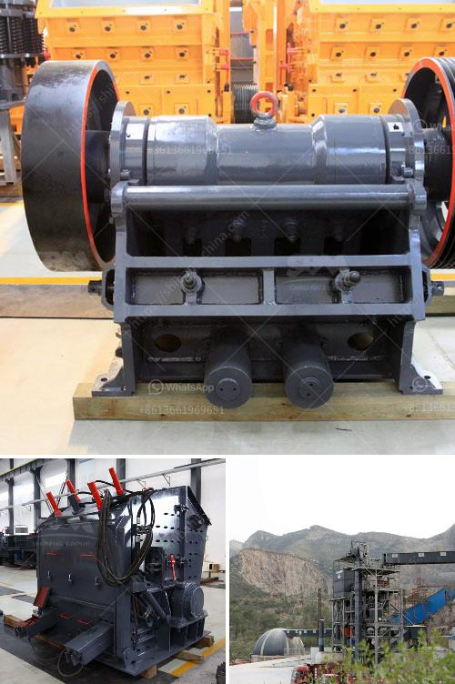

<h3>stone cracher mechine manufacturer</h3>
Are you tired of spending countless hours manually crushing stones for your construction projects? Look no further! Stone crusher machines have revolutionized the way stones are crushed, allowing you to increase productivity and efficiency while reducing labor costs. In this article, we will delve into the world of stone crusher machine manufacturers and uncover the secrets behind their success.

Stone crusher machines are extensively used in the mining, construction, and quarrying industries. Traditionally, stone crushers have required a considerable amount of manual labor for breaking down big rocks into smaller stones. Manual labor has its merits, but it is a slow and inefficient process.

Enter stone crusher machine manufacturers! They have taken the automation game to a whole new level. These manufacturers utilize cutting-edge technology and innovative designs to bring us highly efficient and durable stone crushing machines. With the click of a button, these machines can crush stones into various sizes required by builders and contractors.

One prominent stone crusher machine manufacturer is AIMIX Machinery. They have their headquarters in Zhengzhou, Henan Province, China. AIMIX produces various types of stone crusher machines, such as jaw crusher, impact crusher, cone crusher, vibrating feeder, circular vibrating screen, belt conveyor, and more. They invest heavily in research and development to create durable and efficient stone crusher machines for their customers.

Another well-known stone crusher machine manufacturer is TYM Heavy Industry. Their stone crusher machines are used for crushing rocky materials into desired aggregate, gravels, and smaller stones. TYM Heavy Industry focuses on researching and developing state-of-the-art technologies to meet the ever-evolving demands of their customers. Their machines are known for their robustness, dependability, and user-friendly interface.

When choosing a stone crusher machine manufacturer, it is crucial to consider factors such as durability, efficiency, after-sales support, and affordability. Hence, it is always recommended to read customer reviews and testimonials before making a purchase. Trusted and reliable manufacturers often have a strong customer base and positive feedback from their clients.

The benefits of using stone crusher machines are numerous. They allow you to save time and energy, increase productivity, reduce labor costs, and improve the quality of your construction projects. These machines are designed to withstand heavy-duty operations and are built to last. They are also versatile, allowing you to crush different types of stones for various applications.

In conclusion, stone crusher machine manufacturers play a vital role in the construction industry. They provide the necessary equipment that allows contractors and builders to complete their projects efficiently and effectively. With the advancements in technology, stone crusher machines have become more reliable and energy-efficient, making them a must-have for any construction site. So, why waste time and effort manually crushing stones when you can take advantage of these cutting-edge machines? Invest in a high-quality stone crusher machine and experience the difference in your construction projects.
<h3>Contact us</h3><ul><li><strong>Whatsapp:&nbsp;<a href="https://wa.me/8613661969651">+8613661969651</a></strong></li><li><a href="https://swt.shibang-china.com/?git&amp;zhl&amp;stone cracher mechine manufacturer"><strong>Online Service(chat now)</strong></a></li></ul><h3>Related</h3><ul><li><a href='pakistan fabricated silica sand washing plant.md'>pakistan fabricated silica sand washing plant</a></li><li><a href='list of cement plants in nalgonda district.md'>list of cement plants in nalgonda district</a></li><li><a href='mill balls for mining.md'>mill balls for mining</a></li><li><a href='equipment use in the mining of laterite.md'>equipment use in the mining of laterite</a></li><li><a href='hammer mill nigeria.md'>hammer mill nigeria</a></li></ul>